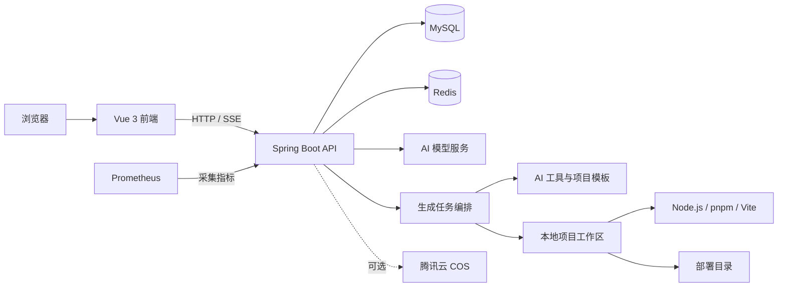

<div align="center">

<h1>🚀 Rush AI Code Mother</h1>

<h3>用一句话描述需求，让 AI 把创意变成真正可运行的应用</h3>

<p>
  <strong>智能生成 · 持续修改 · 实时预览 · 自动验证 · 一键部署</strong>
</p>

<p>
  
  
  
  
  
</p>

<p>
  <a href="#-项目简介">项目简介</a> ·
  <a href="#-为什么选择-rush-ai-code-mother">核心亮点</a> ·
  <a href="#快速开始">快速开始</a> ·
  <a href="#系统架构">系统架构</a> ·
  <a href="#api-模块概览">API 概览</a>
</p>

</div>

---

## ✨ 项目简介

> **Rush AI Code Mother 不只是一个代码生成器，更是一条从创意到产品的智能开发流水线。** 你只需用自然语言描述想法，它就能自动理解需求、选择合适的工程模式、生成并持续修改代码，完成依赖安装、质量检查、实时预览与一键部署，让一个模糊的灵感快速成长为真正可运行、可迭代、可交付的应用。

项目采用前后端分离架构：后端基于 Spring Boot 3 与 LangChain4j，前端基于 Vue 3、TypeScript 和 Ant Design Vue。仓库内同时提供多种项目模板，并包含代码生成、文件编辑、依赖安装、构建校验、Dev Server 预览、部署和失败恢复等完整流程。

## 🌟 为什么选择 Rush AI Code Mother？

| 🧠 不止“生成代码” | 🛠️ 面向真实工程 | 🚀 从创意直接到交付 |
| :---: | :---: | :---: |
| 理解需求并智能选择生成模式，通过连续对话持续完善应用 | 自动处理文件、依赖、构建、测试、诊断与失败恢复 | 生成结果可实时预览、在线修改、打包下载并快速部署 |

<div align="center">

<h3>从一句需求到应用上线</h3>

<p><strong>💡 描述想法　→　🧭 智能路由　→　⚙️ 工程生成　→　✅ 质量验证　→　👀 实时预览　→　🚀 一键部署</strong></p>

</div>

> [!TIP]
> 无论是一个精美落地页、Vue 管理后台、移动端站点，还是带后端与数据库能力的全栈应用，都可以从同一个自然语言入口开始创建。

## 🎯 功能特性

### AI 应用生成

- 通过自然语言描述创建应用，并使用 SSE 实时返回生成过程
- 支持原生 HTML、原生多文件、Vue 工程、后端工程和全栈工程模式
- 根据需求复杂度选择或升级生成模式，避免后续编辑导致工程能力降级
- 支持提示词优化、连续对话修改、停止生成和历史记录查询
- 内置文件读写、项目搜索、依赖分析、构建测试、差异摘要和快照回滚等工具
- 对生成结果执行依赖安装、代码检查、构建验证与自动修复

### 预览与部署

- 为生成项目启动隔离的本地 Dev Server
- 通过后端鉴权代理访问实时预览，避免直接暴露内部端口
- 支持生成代码文件浏览、在线保存和项目打包下载
- 支持应用部署、重新同步部署内容和静态资源访问
- 可选接入腾讯云 COS 保存应用封面等资源

### 用户与管理后台

- 用户注册、登录、退出和 Session 管理
- 我的应用、精选应用、应用复制、编辑与删除
- 管理员用户管理、应用管理、聊天记录管理
- AI 模型目录、模型连接测试、启停和分类路由
- 用户积分余额、生成扣费和积分流水
- 生成任务、模型调用、构建结果和性能指标记录

### 工程能力

- MySQL 持久化、Redis Session、Redis 缓存与分布式限流
- Spring Boot Actuator 与 Prometheus 指标输出
- 开发、生产配置分层及生产配置启动校验
- Maven Enforcer 约束 Java 版本与依赖边界
- Vue/Go 等内置项目模板和模板依赖预热
- 单元测试、回归测试和外部依赖测试分组

## 技术栈

### 后端

| 分类 | 技术 |
| --- | --- |
| 基础框架 | Java 21、Spring Boot 3.5 |
| AI 能力 | LangChain4j、OpenAI Chat Completions 兼容协议 |
| 数据访问 | MyBatis-Flex、MySQL |
| 会话与缓存 | Spring Session、Redis、Redisson、Caffeine |
| 接口文档 | SpringDoc OpenAPI、Knife4j |
| 监控 | Spring Boot Actuator、Micrometer、Prometheus |
| 浏览器能力 | Selenium、WebDriverManager |
| 对象存储 | 腾讯云 COS（可选） |
| 构建测试 | Maven Wrapper、JUnit、Mockito |

### 前端

| 分类 | 技术 |
| --- | --- |
| 核心框架 | Vue 3、TypeScript |
| UI | Ant Design Vue |
| 状态与路由 | Pinia、Vue Router |
| 构建工具 | Vite |
| 网络请求 | Axios |
| 内容展示 | Markdown-It、Highlight.js |
| 质量工具 | ESLint、Prettier、Vitest、vue-tsc |

## 系统架构



## 项目结构

```text
.
├── src/main/java/com/rush/rushaicodemother
│   ├── ai/                         # AI 意图识别、护栏、消息模型与工具
│   ├── application/                # 应用层用例与业务入口
│   ├── controller/                 # REST API 与 SSE 接口
│   ├── core/                       # 代码生成、解析、保存和工程构建
│   ├── infrastructure/             # 文件系统、Git、进程及诊断基础设施
│   ├── orchestration/              # 创建、编辑、校验、恢复和任务编排
│   ├── service/                    # 用户、应用、模型、部署等领域服务
│   ├── mapper/                     # MyBatis-Flex Mapper
│   ├── model/                      # DTO、实体、枚举与视图对象
│   ├── config/                     # Spring 与生产环境配置
│   └── RushAiCodeMotherApplication.java
├── src/main/resources
│   ├── application*.yml            # 公共、开发和生产配置
│   ├── mapper/                     # MyBatis XML
│   ├── prompt/                     # AI 系统提示词
│   ├── agent-skills/               # 生成代理可用技能
│   └── project-templates/          # Vue、Go 等项目模板
├── rush-ai-code-mother-frontend/   # Vue 3 管理端与用户端
├── sql/create_table.sql            # 数据库初始化脚本
├── docs/                           # 补充文档
├── tmp/                            # 默认运行时临时目录
├── pom.xml                         # Maven 配置
└── mvnw / mvnw.cmd                 # Maven Wrapper
```

## 环境要求

开始前请准备以下环境：

- JDK 21 或更高版本
- MySQL
- Redis
- Node.js
- pnpm

其中 Node.js 与 pnpm 不仅用于运行本仓库前端，也会被后端用于安装和构建 AI 生成的前端项目。生产环境应固定 Node.js、pnpm 的版本，并确保后端运行账号可以从 `PATH` 中找到 `node` 和 `pnpm`。

## 快速开始

以下命令以 Windows PowerShell 为例；Linux/macOS 可将 `mvnw.cmd` 替换为 `./mvnw`，环境变量按当前 Shell 语法设置。

### 1. 初始化数据库

启动 MySQL 后执行：

```powershell
mysql -u root -p
```

进入 MySQL 客户端后执行：

```sql
source sql/create_table.sql;
```

脚本会创建并使用 `rush_ai_code_mother` 数据库，同时初始化用户、应用、聊天记录、AI 模型和生成追踪等相关表。

已有数据库升级时，不得重新执行完整初始化脚本。请先备份数据库，再按照
`sql/migrations/README.md` 记录的顺序执行尚未应用的迁移文件。迁移失败必须停止发布，
尤其不得通过清空积分流水或删除完整性约束绕过账务数据问题。

### 2. 启动 Redis

开发环境默认连接：

```text
Host: localhost
Port: 6379
Database: 7
```

如本地 Redis 配置不同，请通过环境变量或本地配置文件覆盖。

### 3. 配置后端

开发环境默认使用 Maven `dev` Profile。推荐通过环境变量提供本地数据库和 Redis 配置：

```powershell
$env:MYSQL_URL='jdbc:mysql://localhost:3306/rush_ai_code_mother?useUnicode=true&characterEncoding=utf8&serverTimezone=Asia/Shanghai'
$env:MYSQL_USERNAME='root'
$env:MYSQL_PASSWORD='你的数据库密码'
$env:REDIS_HOST='localhost'
$env:REDIS_PORT='6379'
$env:REDIS_DATABASE='7'
$env:REDIS_PASSWORD=''
```

也可以创建不会提交到 Git 的 `src/main/resources/application-local.yml`：

```yaml
spring:
  datasource:
    username: root
    password: your-password
  data:
    redis:
      host: localhost
      port: 6379
      database: 7
      password: ""
```

使用本地覆盖配置启动时：

```powershell
$env:SPRING_PROFILES_ACTIVE='dev,local'
.\mvnw.cmd spring-boot:run
```

如果不需要额外的 `local` Profile，直接运行：

```powershell
.\mvnw.cmd spring-boot:run
```

后端默认地址为 `http://localhost:8123/api`。

大规模代码生成提交默认限制为单次 `20000` 个去重文件、Git pathspec 清单 `2097152` 字节；可分别通过
`GENERATION_COMMIT_MAX_FILES_PER_COMMIT` 和 `GENERATION_COMMIT_MAX_PATHSPEC_BYTES` 调整。生产环境完整变量说明见
`docs/backend-production-configuration.md`。

### 4. 创建管理员并配置 AI 模型

系统不在代码库中内置真实 AI 密钥。首次启动后：

1. 在前端注册一个普通用户。
2. 在本地数据库中将该账号设置为管理员：

```sql
update user
set userRole = 'admin'
where userAccount = 'your-account';
```

3. 重新登录，进入“模型管理”页面。
4. 根据模型目录填写 API Base URL、模型 ID 和 API Key。
5. 先执行连接测试，再启用对应的生成、推理或路由模型。

AI 模型 API Key 会在写入时进行 AES-256-GCM envelope encryption；数据库只保存密文引用、HMAC 指纹和 KEK ID。生产环境必须通过 Secret Manager 注入独立的 `AI_MODEL_SECRET_ACTIVE_KEY` 与 `AI_MODEL_SECRET_FINGERPRINT_KEY`，不得把 API Key 或主密钥写入 `application.yml`、日志或 Git。

### 5. 启动前端

打开新的终端：

```powershell
cd rush-ai-code-mother-frontend
pnpm install
pnpm dev
```

前端默认运行在 `http://localhost:5173`，开发服务器会将 `/api` 请求代理到 `http://localhost:8123`。

### 6. 验证服务

| 服务 | 地址 |
| --- | --- |
| 前端 | `http://localhost:5173` |
| 后端 API 根路径 | `http://localhost:8123/api` |
| 兼容进程存活检查 | `http://localhost:8123/api/health/` |
| Actuator 存活探针 | `http://localhost:8123/api/actuator/health/liveness` |
| Actuator 就绪探针 | `http://localhost:8123/api/actuator/health/readiness` |
| Actuator 聚合健康检查 | `http://localhost:8123/api/actuator/health` |
| Knife4j（开发环境） | `http://localhost:8123/api/doc.html` |
| OpenAPI JSON（开发环境） | `http://localhost:8123/api/v3/api-docs` |
| Prometheus 指标 | `http://localhost:8123/api/actuator/prometheus` |

生产 Profile 默认关闭 OpenAPI 与 Knife4j，并隐藏健康检查内部细节。

## 常用命令

### 后端

```powershell
# 启动开发环境
.\mvnw.cmd spring-boot:run

# 运行默认测试集
.\mvnw.cmd test

# 编译
.\mvnw.cmd -DskipTests compile

# 构建开发产物
.\mvnw.cmd clean package

# 构建生产产物
.\mvnw.cmd -Pprod clean package

# 启动生产 JAR
java -jar target/rush-ai-code-mother-0.0.1-SNAPSHOT.jar
```

默认测试会排除标记为 `external` 和 `integration` 的测试，避免本地测试意外访问真实第三方服务。Redis 持久化契约可使用隔离实例显式验证：

```powershell
docker run --rm -d --name ai-mother-redis-it -p 56379:6379 redis:7-alpine
.\mvnw.cmd -Pintegration-test '-Dtest=RedisChatMemoryRestartIntegrationTest,RedisGenerationRuntimeIntegrationTest' '-Dintegration.redis.host=127.0.0.1' '-Dintegration.redis.port=56379' test
docker stop ai-mother-redis-it
```

Milvus 长期记忆契约使用与 CI 相同的隔离服务，验证数据面健康以及真实写入、召回和按应用删除：

```powershell
docker compose --project-name ai-mother-milvus-it --file docker/milvus/compose.ci.yml up --detach --wait --wait-timeout 300
.\mvnw.cmd -Pdev,external-test '-Dtest=MilvusConnectionExternalTest,MilvusLongTermMemoryStoreExternalTest,MilvusMemorySpringWiringTest' '-DmilvusUri=http://127.0.0.1:19530' test
docker compose --project-name ai-mother-milvus-it --file docker/milvus/compose.ci.yml down --volumes --remove-orphans
```

### 前端

```powershell
cd rush-ai-code-mother-frontend

# 本地开发
pnpm dev

# 类型检查并构建
pnpm build

# 单元测试
pnpm test

# ESLint 检查并自动修复
pnpm lint

# 格式化 src 目录
pnpm format

# 预览生产构建
pnpm preview
```

## 核心配置

| 环境变量 | 默认值 | 说明 |
| --- | --- | --- |
| `SERVER_PORT` | `8123` | 后端端口 |
| `MYSQL_URL` | 本机 `rush_ai_code_mother` | MySQL JDBC 地址 |
| `MYSQL_USERNAME` | `root` | MySQL 用户名 |
| `MYSQL_PASSWORD` | 开发配置内有本地默认值 | 建议始终显式覆盖 |
| `REDIS_HOST` | `localhost` | Redis 主机 |
| `REDIS_PORT` | `6379` | Redis 端口 |
| `REDIS_DATABASE` | 开发 `7`、生产 `0` | Redis Database |
| `REDIS_PASSWORD` | 空 | Redis 密码 |
| `GENERATION_EVENT_STREAM_TRANSPORT` | 开发 `local`、生产 `redis` | 跨实例生成事件传输；生产环境必须使用 Redis Streams |
| `GENERATION_EVENT_STREAM_DELTA_COALESCING_ENABLED` | `true` | 是否仅在 Redis 共享传输边界合并相邻 AI 文本增量；首段、工具和终态事件仍立即写入 |
| `GENERATION_EVENT_STREAM_DELTA_FLUSH_INTERVAL` | `40ms` | 文本增量最大等待窗口，允许 `10ms` 至 `1s` |
| `GENERATION_EVENT_STREAM_DELTA_MAX_CHARS` | `2048` | 单次文本增量缓冲字符上限，允许 `64` 至 `65536`；达到上限立即冲刷 |
| `CHAT_MEMORY_TTL_SECONDS` | `3600` | Redis 对话记忆 TTL（秒） |
| `CHAT_MEMORY_FALLBACK_MAX_ENTRIES` | `1000` | Redis 故障期间进程内回退状态总容量；待回灌变更不会被静默淘汰 |
| `CHAT_MEMORY_FALLBACK_EXPIRE_AFTER_ACCESS` | `2h` | 已同步对话记忆副本的访问过期时间；不作用于待回灌变更 |
| `CHAT_MEMORY_COMPLETED_TOOL_ARGUMENTS_MAX_CHARS` | `8192` | 已完成写文件调用在后续模型请求中的参数保留阈值；超限后只保留路径和落盘占位符 |
| `WORKING_MEMORY_MAX_TASKS` | `2000` | 单实例短期任务工作记忆容量 |
| `WORKING_MEMORY_RETENTION` | `2h` | 短期任务工作记忆保留时间 |
| `WORKING_MEMORY_MAX_RECENT_EVENTS` | `100` | 单任务保留的最近事件上限 |
| `MILVUS_MEMORY_ENABLED` | `false`（生产强制 `true`） | 是否启用 Milvus 长期语义记忆；关闭时 generation outbox 不会把进程内缓存误标为持久化成功 |
| `MILVUS_URI` | 空 | Milvus SDK 的 gRPC/HTTPS 入口；生产必填，不能填写 REST `9091` 或 etcd `2379` 地址 |
| `MILVUS_TOKEN` | 空 | Milvus 认证 token；生产通过 Secret 注入 |
| `MILVUS_AUTHENTICATION_REQUIRED` | `false`（生产强制 `true`） | 是否要求非空 token |
| `MILVUS_TLS_REQUIRED` | `false`（生产强制 `true`） | 是否只允许 HTTPS Milvus endpoint |
| `MILVUS_DATABASE` | `default` | Milvus database 名称 |
| `MILVUS_MEMORY_COLLECTION` | `generation_memory_v2` | 显式版本化的长期记忆 collection；不兼容旧 schema 时禁止原地复用 |
| `MILVUS_CONNECT_TIMEOUT` | `3s` | Milvus 建连超时 |
| `MILVUS_REQUEST_TIMEOUT` | `5s` | Milvus RPC deadline |
| `MILVUS_READINESS_TIMEOUT` | `60s` | collection/index load 与创建的同步等待上限 |
| `MILVUS_READINESS_REFRESH_INTERVAL` | `30s` | schema、index、load 状态重新校验周期 |
| `MILVUS_VERIFY_ON_STARTUP` | `false`（生产强制 `true`） | 启动时是否 fail-fast 验证 Milvus 完整契约 |
| `MILVUS_FALLBACK_MAX_ENTRIES` | `5000` | 单实例有界长期记忆回退缓存容量 |
| `MILVUS_FALLBACK_RETENTION` | `12h` | 长期记忆回退缓存保留时间 |
| `MILVUS_MEMORY_TOP_K` | `6` | 单次长期记忆召回上限 |
| `MILVUS_MEMORY_MINIMUM_SCORE` | `0.45` | COSINE 召回最低分数 |
| `GENERATION_MEMORY_CONTEXT_PARALLEL_READS_ENABLED` | `false` | 是否并行读取最近任务、构建日志和长期语义记忆；发布前必须用 Benchmark 证明首 Token 收益且无质量回退 |
| `GENERATION_MEMORY_CONTEXT_MAX_CONCURRENT_READS` | `12` | 单实例生成记忆上下文只读 I/O 的全局并发上限 |
| `GENERATION_MEMORY_CONTEXT_PREPARATION_OVERLAP_ENABLED` | `false` | 是否让记忆构建与 Planner、模板准备和项目索引重叠执行；仅允许经 Benchmark 灰度开启 |
| `GENERATION_MEMORY_CONTEXT_MAX_CONCURRENT_PREPARATION_OVERLAPS` | `4` | 单实例可并行运行的记忆准备任务上限；许可耗尽时受任务 deadline 约束等待 |
| `GENERATION_MEMORY_CONTEXT_PREPARATION_OVERLAP_TIMEOUT` | `30s` | 单次记忆重叠任务从提交到 Context 汇合的最大时长，并受任务总 deadline 进一步收紧 |
| `GENERATION_MEMORY_CONTEXT_SHUTDOWN_TIMEOUT` | `10s` | 应用关闭时等待生成记忆读取任务收口的上限 |
| `GENERATION_MEMORY_OUTBOX_ENABLED` | `true` | generation memory 与应用删除 durable outbox 开关；生产强制开启 |
| `GENERATION_MEMORY_OUTBOX_SCAN_INTERVAL` | `30s` | outbox 扫描周期 |
| `GENERATION_MEMORY_OUTBOX_BATCH_SIZE` | `50` | 单轮最多 claim 的任务数，最大 `500` |
| `GENERATION_MEMORY_OUTBOX_MAX_ATTEMPTS` | `10` | generation memory 最大尝试次数；达到后进入可观测 dead-letter |
| `GENERATION_MEMORY_OUTBOX_LEASE_DURATION` | `2m` | 多实例 worker claim 租约时长 |
| `GENERATION_MEMORY_OUTBOX_INITIAL_RETRY_DELAY` | `30s` | 首次指数退避时长 |
| `GENERATION_MEMORY_OUTBOX_MAX_RETRY_DELAY` | `1h` | 指数退避上限 |
| `CORS_ALLOWED_ORIGINS` | `http://localhost:5173` | 生产环境前端 Origin 白名单 |
| `CODE_DEPLOY_HOST` | `http://localhost:91` | 已部署应用的公开访问根地址 |
| `CODE_OUTPUT_ROOT_DIR` | `tmp/code_output` | AI 生成工作区根目录 |
| `CODE_DEPLOY_ROOT_DIR` | `tmp/code_deploy` | 已部署应用视图根目录 |
| `CODE_SNAPSHOT_ROOT_DIR` | `tmp/code_snapshot` | 生成事务快照根目录；必须与工作区和部署根目录隔离 |
| `COS_ENABLED` | `false` | 是否启用腾讯云 COS |
| `TEMPLATE_PRE_WARM_ENABLED` | 开发开启、生产关闭 | 是否在启动时预热模板依赖 |
| `TEMPLATE_MATERIALIZATION_MAX_FILES` | `2000` | 单次模板物化允许复制的最大文件数 |
| `TEMPLATE_MATERIALIZATION_MAX_FILE_BYTES` | `10485760` | 单个模板文件最大字节数（10 MiB） |
| `TEMPLATE_MATERIALIZATION_MAX_TOTAL_BYTES` | `104857600` | 单次模板物化累计最大字节数（100 MiB） |
| `TEMPLATE_MATERIALIZATION_MAX_RELATIVE_PATH_LENGTH` | `1024` | 模板资源相对路径最大长度 |
| `TEMPLATE_MATERIALIZATION_MAX_DIRECTORY_DEPTH` | `32` | 模板资源最大目录深度 |
| `TEMPLATE_MATERIALIZATION_PUBLISH_MAX_ATTEMPTS` | `5` | Windows 等文件系统发生瞬时目录发布冲突时的最大尝试次数 |
| `TEMPLATE_MATERIALIZATION_PUBLISH_RETRY_DELAY_MILLIS` | `50` | 模板目录发布重试间隔（毫秒） |
| `GO_TOOLCHAIN_GO_EXECUTABLE` | `go` | 受控 Go 构建测试使用的可执行文件名或绝对路径 |
| `PROJECT_COMMAND_GO_TEST_TIMEOUT` | `3m` | 后端 Go 项目完整测试的总超时 |
| `PROJECT_COMMAND_GO_TEST_IDLE_TIMEOUT` | `2m` | Go 构建或测试持续无输出时的超时 |
| `GENERATED_CODE_SANDBOX_GO_BUILD_TMPFS_SIZE` | `512m` | 容器内受控离线 `go build/install/run/test` 专用可执行 tmpfs 上限；普通 `/tmp` 仍为 `noexec` |
| `GENERATION_BENCHMARK_BROWSER_GRADING_ENABLED` | `false` | 浏览器 Runtime/Visual 评分开关；专用发布门禁 Worker 必须开启 |
| `GENERATION_BENCHMARK_BACKEND_GRADING_ENABLED` | `false` | 后端与全栈真实运行时评分开关；专用发布门禁 Worker 必须开启 |
| `GENERATION_BENCHMARK_BACKEND_STARTUP_TIMEOUT` | `45s` | 候选后端启动和健康检查总等待上限 |
| `GENERATION_BENCHMARK_BACKEND_REQUEST_TIMEOUT` | `3s` | 单次后端回环健康请求超时 |
| `GENERATION_BENCHMARK_BACKEND_POLL_INTERVAL` | `100ms` | 后端启动健康轮询间隔 |
| `GENERATION_BENCHMARK_BACKEND_PROCESS_TIMEOUT` | `2m` | 候选后端和启动就绪模板测试的进程总超时 |
| `GENERATION_BENCHMARK_BACKEND_HEARTBEAT_INTERVAL` | `5s` | 受管后端进程心跳间隔 |
| `GENERATION_BENCHMARK_BACKEND_OUTPUT_DRAIN_TIMEOUT` | `2s` | 进程退出后排空输出消费者的等待上限 |
| `GENERATION_BENCHMARK_BACKEND_SHUTDOWN_TIMEOUT` | `10s` | 评分结束后等待候选后端收口的上限 |
| `GENERATION_BENCHMARK_BACKEND_MAX_OUTPUT_LENGTH` | `65536` | 单个候选后端最多保留的进程输出字符数 |
| `GENERATION_BENCHMARK_BACKEND_MAX_RESPONSE_BYTES` | `65536` | 后端健康响应体最大字节数 |
| `GENERATION_BENCHMARK_BACKEND_PORT_RANGE_START` | `19000` | 节点本地后端评分端口池起始值 |
| `GENERATION_BENCHMARK_BACKEND_PORT_RANGE_END` | `19999` | 节点本地后端评分端口池结束值 |
| `GENERATION_BENCHMARK_BACKEND_WORKSPACE_ROOT` | JVM 临时目录下的 `ai-code-mother/benchmark-backend-runtime` | 一次性候选副本和启动就绪检查目录 |
| `GENERATION_BENCHMARK_GRADER_FINGERPRINT` | `generation-benchmark-graders-v6` | 当前评分器协议指纹；评分代码、数据集和证据消费者必须同步升级 |
| `GENERATION_BENCHMARK_WORKER_OUTPUT_FILE` | Worker 启用时必填 | 原子写入的 CI 结果 JSON 绝对路径或工作目录相对路径 |
| `GENERATION_BENCHMARK_WORKER_EVIDENCE_VALIDITY` | `1d` | 通过门禁后签发证据的有效期，不得超过 `7d` |
| `GENERATION_BENCHMARK_WORKER_CANDIDATE_TYPE` | Worker 启用时必填 | `AI_MODEL_ENABLE` 或 `PROMPT_RELEASE` |
| `GENERATION_BENCHMARK_WORKER_MODEL_ID` | `0` | 模型启用候选的数据库编号；Prompt 候选必须保持 `0` |
| `GENERATION_BENCHMARK_WORKER_PROMPT_KEY` | 空 | Prompt 发布候选的 Prompt Key |
| `GENERATION_BENCHMARK_WORKER_STABLE_VERSION` | 空 | Prompt 发布候选的稳定版本 |
| `GENERATION_BENCHMARK_WORKER_CANARY_VERSION` | 空 | 灰度比例大于 `0` 时必填的灰度版本 |
| `GENERATION_BENCHMARK_WORKER_CANARY_PERCENTAGE` | `0` | Prompt 候选灰度比例，范围 `0` 到 `100` |
| `GENERATION_BENCHMARK_FIRST_PREVIEW_OBSERVATION_TIMEOUT` | `2s` | durable 任务已终态但跨节点事件仍在传输时，等待首预览里程碑到达的有界窗口 |
| `GENERATION_BENCHMARK_MINIMUM_FIRST_PREVIEW_OBSERVATION_RATE` | `1.0` | 发布报告必须观测到首预览的任务比例；缺失值不会按 `0ms` 计入统计 |
| `GENERATION_BENCHMARK_MAXIMUM_P90_FIRST_TOKEN_LATENCY` | `15s` | 全数据集首 Token p90 上限 |
| `GENERATION_BENCHMARK_MAXIMUM_P99_FIRST_TOKEN_LATENCY` | `30s` | 全数据集首 Token p99 尾延迟上限；不得低于 p90 上限 |
| `GENERATION_BENCHMARK_MAXIMUM_P90_CREATE_FIRST_PREVIEW_LATENCY` | `60s` | CREATE 路由首预览 p90 上限，默认跟随在线路由 SLA |
| `GENERATION_BENCHMARK_MAXIMUM_P90_LIGHT_EDIT_FIRST_PREVIEW_LATENCY` | `90s` | LIGHT_EDIT 路由首预览 p90 上限，默认跟随在线路由 SLA |
| `GENERATION_BENCHMARK_MAXIMUM_P90_AGENT_EDIT_FIRST_PREVIEW_LATENCY` | `3m` | AGENT_EDIT 路由首预览 p90 上限，默认跟随在线路由 SLA |
| `GENERATION_BENCHMARK_MAXIMUM_P90_HEAVY_FIRST_PREVIEW_LATENCY` | `5m` | HEAVY_EXPERT 路由首预览 p90 上限，默认跟随在线路由 SLA |
| `GENERATION_BENCHMARK_MAXIMUM_P99_FIRST_PREVIEW_LATENCY` | `5m` | 全数据集首预览 p99 尾延迟上限 |
| `AI_LOG_REQUESTS` | `false` | 是否记录生成模型请求 |
| `AI_LOG_RESPONSES` | `false` | 是否记录生成模型响应 |
| `AI_LOCAL_FIRST_HEAVY_ROUTING_ENABLED` | `true` | HEAVY 目标类型是否优先使用高置信本地规则；关闭后恢复为所有 HEAVY 请求调用类型路由模型 |
| `AI_FIRST_TOKEN_HEDGE_ENABLED` | `false` | 是否为任务级限时流式请求启用首 Token 对冲 |
| `AI_FIRST_TOKEN_HEDGE_DELAY` | `3s` | 主候选无输出时启动单个影子候选前的等待时间，范围 `250ms` 至 `30s` |
| `AI_FIRST_TOKEN_HEDGE_REQUIRE_DISTINCT_PROVIDER` | `true` | 是否要求主候选与影子候选来自不同供应商 |
| `AI_ROOT_MODEL_RETRY_MIN_DELAY` | `3s` | 零输出瞬态失败后刷新健康模型池前的最小退避，范围 `100ms` 至 `1m` |
| `AI_ROOT_MODEL_RETRY_MAX_DELAY` | `20s` | 根模型指数退避上限，不得小于最小退避且不得超过 `1m` |
| `AI_ROOT_MODEL_RETRY_JITTER` | `0.35` | 根模型退避随机抖动比例，范围 `0.0` 至 `1.0` |
| `GENERATION_<ROUTE>_FIRST_PREVIEW_COMPLETION_RESERVE` | CREATE `45s`、LIGHT_EDIT `30s`、AGENT_EDIT `45s`、HEAVY `60s`、SATURATED `30s` | 在路由首预览 SLA 内为本地渲染、校验、写入和发布保留的确定性完成窗口；进入该窗口后取消或跳过可选 AI 增强，不会终止整个任务 |
| `GENERATION_FIRST_PREVIEW_COMPLETION_RESERVE` | `10s` | 未携带路由 SLA 信封的兼容执行路径完成预留 |
| `GENERATION_STREAM_SNAPSHOT_UPDATE_INTERVAL` | `5s` | 重型生成断线快照写入数据库的最小间隔，范围 `100ms` 至 `1m`；实时事件会先推送，不等待快照写入 |
| `GENERATION_STREAM_SNAPSHOT_MAX_CHARS` | `20000` | 数据库断线快照保留的尾部字符上限，范围 `1` 至 `100000` |
| `GENERATION_SESSION_LOCK_STRIPES` | `64` | 单实例生成启动互斥的固定条带锁数量；不会按应用 ID 增长。 |
| `GENERATION_SESSION_MAX_TRACKED_SESSIONS` | `1000` | 单实例活动会话与短期回放会话总容量；满载时新应用生成请求明确返回服务暂不可用。 |
| `GENERATION_SESSION_COMPLETED_REPLAY_RETENTION` | `30s` | 已完成轻量会话为 SSE 重连保留的时间，最长 `1h`。 |
| `GENERATION_SESSION_CLEANUP_INTERVAL` | `5s` | 批量清理过期回放会话的固定周期，不得大于回放保留时间。 |
| `GENERATION_TASK_SNAPSHOT_ENABLED` | `true` | 是否保存本机编排诊断快照；关闭后不影响数据库生成状态 |
| `GENERATION_REPLAY_SAFE_START_CHECKPOINT_ELISION_ENABLED` | `false` | 是否省略显式可重放 DAG 节点的开始检查点；必须先通过 Benchmark 并灰度开启 |
| `GENERATION_REPLAY_SAFE_COMPLETION_CHECKPOINT_COALESCING_ENABLED` | `false` | 是否合并连续可重放节点的完成检查点；只能与开始检查点省略同时启用 |
| `GENERATION_REPLAY_SAFE_COMPLETION_CHECKPOINT_INTERVAL` | `4` | 连续完成多少个可重放节点后强制建立持久化边界，范围 `2` 至 `64` |
| `GENERATION_TASK_SNAPSHOT_ROOT_DIRECTORY` | `tmp/orchestration_tasks` | 编排诊断快照根目录 |
| `GENERATION_TASK_SNAPSHOT_MAX_BYTES` | `2097152` | 单个编排诊断快照最大 UTF-8 字节数 |
| `GENERATION_TASK_SNAPSHOT_MAX_PER_APP` | `100` | 单个应用最多保留的诊断快照数 |
| `GENERATION_TASK_SNAPSHOT_RETENTION` | `7d` | 编排诊断快照保留期限 |
| `GENERATION_TASK_SNAPSHOT_LOCK_STRIPES` | `64` | 单实例快照写入条带锁数量 |
| `EDIT_STATE_ENABLED` | `true` | 是否将连续改修文件召回状态保存到本机；关闭后仍保留有界进程内缓存 |
| `EDIT_STATE_ROOT_DIRECTORY` | `tmp/edit_state` | 编辑状态本地文件根目录 |
| `EDIT_STATE_MAX_CACHE_ENTRIES` | `1000` | 单实例编辑状态缓存的最大应用数 |
| `EDIT_STATE_CACHE_EXPIRE_AFTER_ACCESS` | `2h` | 编辑状态缓存访问过期时间，不得超过磁盘状态保留期限 |
| `EDIT_STATE_RETENTION` | `24h` | 本地编辑状态文件保留期限 |
| `EDIT_STATE_MAX_PERSISTED_APPS` | `10000` | 本地最多保留状态文件的应用数 |
| `EDIT_STATE_MAX_FILE_BYTES` | `1048576` | 单个编辑状态文件最大字节数 |
| `EDIT_STATE_MAX_RECENT_EDITS` | `20` | 单应用最多保留的最近编辑记录数 |
| `EDIT_STATE_MAX_RECENT_FILES` | `50` | 单应用最多保留的最近文件数 |
| `EDIT_STATE_MAX_RECENT_VALIDATIONS` | `20` | 单应用最多保留的验证状态数 |
| `EDIT_STATE_MAX_TASK_ID_LENGTH` | `128` | 可持久化任务标识的最大长度 |
| `EDIT_STATE_MAX_FILE_PATH_LENGTH` | `1024` | 可持久化相对文件路径的最大长度 |
| `EDIT_STATE_LOCK_STRIPES` | `64` | 单实例同应用状态更新的条带锁数量 |
| `WORKSPACE_MAX_FILES` | `20000` | 单次工作区扫描、快照复制或在线文件树允许处理的最大文件数。 |
| `WORKSPACE_MAX_DIRECTORY_DEPTH` | `64` | 工作区扫描和快照复制允许进入的最大目录深度。 |
| `WORKSPACE_MAX_SCANNED_BYTES` | `2147483648` | 单次只读工作区扫描允许累计索引的最大字节数。 |
| `WORKSPACE_MAX_FILE_BYTES` | `104857600` | 快照复制允许处理的单文件最大字节数。 |
| `WORKSPACE_MAX_READABLE_FILE_BYTES` | `2097152` | 语义索引、代码图和差异摘要允许读取的单文件最大字节数。 |
| `WORKSPACE_MAX_INTERACTIVE_FILE_BYTES` | `1048576` | 在线预览和编辑允许读取或写入的单文件最大字节数。 |
| `WORKSPACE_MAX_INTERACTIVE_TREE_DEPTH` | `8` | 在线应用代码文件树允许展示的最大目录深度。 |
| `WORKSPACE_MAX_COPY_BYTES` | `2147483648` | 单次事务型目录复制允许写入的最大总字节数。 |
| `WORKSPACE_MAX_PERSISTED_FILE_BYTES` | `67108864` | 工作区服务原子持久化单文件的最大字节数。 |
| `WORKSPACE_MAX_LISTED_DIRECTORIES` | `1000` | 单次快照目录列表或在线文件树允许返回的最大目录数。 |
| `WORKSPACE_PUBLISH_MAX_ATTEMPTS` | `5` | Windows 瞬时目录占用导致发布失败时，快照创建、工作区恢复和原目录回切的最大尝试次数。 |
| `WORKSPACE_PUBLISH_RETRY_DELAY_MILLIS` | `50` | 工作区目录发布遇到瞬时访问拒绝后的重试间隔（毫秒）；重试期间出现的目标目录不会被覆盖。 |
| `GENERATION_CONTEXT_MAX_PROJECT_INDEX_FILES` | `80` | 生成提示词中的项目索引最多包含的文件数。 |
| `GENERATION_CONTEXT_MAX_SINGLE_FILE_CHARS` | `1400` | 单个语义索引选中文件可进入生成上下文的最大字符数。 |
| `GENERATION_CONTEXT_MAX_TOTAL_CONTEXT_CHARS` | `10000` | 单次生成项目上下文的总字符预算，不得小于单文件预算。 |
| `GENERATION_CONTEXT_MAX_READABLE_FILE_BYTES` | `1048576` | 生成上下文允许读取的单个关键文件最大字节数。 |
| `AI_CONTEXT_PACK_GENERATION_MAX_TOKENS` | `2000` | 常规生成的长期记忆、近期任务和构建证据上下文总 token 预算。 |
| `AI_CONTEXT_PACK_REPAIR_MAX_TOKENS` | `1500` | 自动修复上下文的独立 token 预算。 |
| `AI_CONTEXT_PACK_TOKENIZER_MODEL` | `gpt-4o` | 上下文预算使用的 OpenAI-compatible tokenizer；所有生产节点必须保持一致。 |
| `AI_CONTEXT_PACK_TOKEN_SAFETY_MARGIN` | `1.15` | 针对兼容供应商分词差异和消息 framing 的保守余量，允许范围 `1.0`～`2.0`。 |
| `AI_CONTEXT_PACK_MAX_SECTION_TOKENS` | `800` | 单个上下文 section 的 token 上限。 |
| `AI_CONTEXT_PACK_MINIMUM_SECTION_TOKENS` | `64` | 可选 section 被保留时的最小 token 预算。 |
| `AI_CONTEXT_PACK_MAX_SEMANTIC_MEMORY_SECTIONS` | `6` | 单次模型调用最多选择的长期语义记忆条数。 |
| `AI_CONTEXT_PACK_SEMANTIC_MEMORY_HALF_LIFE` | `30d` | 长期记忆相关性随时间衰减的半衰期。 |
| `AI_CONTEXT_PACK_MINIMUM_SEMANTIC_TRUST` | `0.25` | 语义记忆时间衰减后的最低信任权重，允许范围 `0.0`～`1.0`。 |
| `ARTIFACT_COPY_TIMEOUT` | `15m` | Hard timeout for one Windows robocopy operation. |
| `ARTIFACT_COPY_HEARTBEAT_INTERVAL` | `30s` | Heartbeat interval while robocopy is running; must be shorter than the copy timeout. |
| `ARTIFACT_COPY_OUTPUT_DRAIN_TIMEOUT` | `5s` | Maximum wait for bounded process-output consumers to finish. |
| `ARTIFACT_COPY_MAX_OUTPUT_LENGTH` | `8000` | Maximum retained characters for each robocopy output stream. |
| `ARTIFACT_COPY_MAX_FILES` | `20000` | Maximum files accepted by one generated-source or deployment artifact copy. |
| `ARTIFACT_COPY_MAX_DIRECTORIES` | `5000` | Maximum directories accepted by one artifact copy, excluding the source root. |
| `ARTIFACT_COPY_MAX_DIRECTORY_DEPTH` | `64` | Maximum artifact directory depth relative to the source root. |
| `ARTIFACT_COPY_MAX_FILE_BYTES` | `104857600` | Maximum size of one artifact file in bytes. |
| `ARTIFACT_COPY_MAX_TOTAL_BYTES` | `2147483648` | Maximum cumulative file bytes accepted by one artifact copy. |
| `ARTIFACT_PUBLISH_MAX_ATTEMPTS` | `5` | Maximum attempts for an artifact directory publish or switch after transient access denial. |
| `ARTIFACT_PUBLISH_RETRY_DELAY_MILLIS` | `50` | Delay in milliseconds between bounded artifact publication retries. |
| `PROJECT_COMMAND_RECENT_BUILD_RESULT_MAX_ENTRIES` | `500` | 内存中最多保留的最近 Vue 构建结果数量。 |
| `EDIT_LOCATOR_MAX_CANDIDATE_FILES` | `8` | Maximum number of ordered edit-file candidates. |
| `EDIT_LOCATOR_MAX_SINGLE_FILE_CHARS` | `20480` | Maximum characters contributed by one edit-context file. |
| `EDIT_LOCATOR_MAX_TOTAL_CONTEXT_CHARS` | `61440` | Maximum total characters in one edit context package. |
| `EDIT_LOCATOR_MAX_SCANNED_FILES` | `20000` | Maximum files visited by one edit-workspace scan. |
| `EDIT_LOCATOR_MAX_READABLE_FILE_BYTES` | `2097152` | Maximum source file size accepted for edit-context reads. |
| `EDIT_LOCATOR_MAX_PROJECT_INDEX_FILES` | `80` | Maximum entries included in the compact project index. |
| `PATCH_MAX_OPERATIONS` | `100` | Maximum operations accepted in one local patch batch. |
| `PATCH_MAX_OPERATION_CONTENT_CHARS` | `1000000` | Maximum combined content characters carried by one patch operation. |
| `PATCH_MAX_TOTAL_CONTENT_CHARS` | `5000000` | Maximum combined content characters carried by one patch batch. |
| `PATCH_MAX_READABLE_FILE_BYTES` | `5242880` | Maximum existing file size accepted by patch validation, mutation, and post-edit backend validation. |
| `PATCH_MAX_WRITTEN_FILE_BYTES` | `10485760` | Maximum UTF-8 output size of one patched file. |
| `PATCH_MAX_ROLLBACK_SNAPSHOT_BYTES` | `20971520` | Maximum in-memory pre-mutation snapshot size used for batch rollback. |

更多生产环境变量、超时、限流、Dev Server 和依赖安装参数，请查看 [后端生产环境配置基线](docs/backend-production-configuration.md)。

专用 Benchmark Worker 必须同时开启 Browser 与 Backend grading。数据集 `2.1.0` 的全部 `32` 条任务都要求真实 Runtime 证据，Vue 与全栈共 `25` 条任务还要求 Visual 证据。Backend grading 开启后，Worker 会在接收任务前通过当前沙箱离线编译并测试内置 Go+SQLite 模板，同时验证一次性工作区可创建和清理；生产环境推荐使用摘要固定且已验证的容器镜像，Host-Local 必须提供完整 Go SDK 和离线模块缓存。

### 候选 Benchmark Worker

Worker 必须使用与发布控制面相同的已提交制品，并按 `prod,benchmark-worker` 的顺序激活 profile。后一个 profile 会关闭 Web Server、普通后台调度、Redis 任务消费者和跨节点事件流；模型池和 Prompt bundle 在整轮评测前冻结，任何数据库候选或依赖状态漂移都会拒绝签发证据。模型启用候选会在对应模型类型内置于首选位置，并且必须在完整门禁执行窗口内观测到至少一次真实 provider 请求；窗口外请求不计数。物理请求次数进入 HMAC 证据签名协议 `v2`，入库与发布验签会再次校验。

模型启用候选示例：

```powershell
$env:SPRING_PROFILES_ACTIVE = "prod,benchmark-worker"
$env:GENERATION_BENCHMARK_WORKER_OUTPUT_FILE = "D:\benchmark\model-42.json"
$env:GENERATION_BENCHMARK_WORKER_CANDIDATE_TYPE = "AI_MODEL_ENABLE"
$env:GENERATION_BENCHMARK_WORKER_MODEL_ID = "42"
java -jar .\target\rush-ai-code-mother-0.0.1-SNAPSHOT.jar
```

Prompt 发布候选示例：

```powershell
$env:SPRING_PROFILES_ACTIVE = "prod,benchmark-worker"
$env:GENERATION_BENCHMARK_WORKER_OUTPUT_FILE = "D:\benchmark\prompt-v2.json"
$env:GENERATION_BENCHMARK_WORKER_CANDIDATE_TYPE = "PROMPT_RELEASE"
$env:GENERATION_BENCHMARK_WORKER_PROMPT_KEY = "codegen-vue-project"
$env:GENERATION_BENCHMARK_WORKER_STABLE_VERSION = "v2"
$env:GENERATION_BENCHMARK_WORKER_CANARY_VERSION = ""
$env:GENERATION_BENCHMARK_WORKER_CANARY_PERCENTAGE = "0"
java -jar .\target\rush-ai-code-mother-0.0.1-SNAPSHOT.jar
```

以上命令仍需注入完整生产数据库、Redis、Milvus、模型密钥、证据签名密钥、Chrome/ChromeDriver 和容器沙箱配置。Worker 通过后会在同一控制数据库中完成 envelope 签名、验签和证据入库，并将 `evidenceId`、`candidatePhysicalRequestCount` 与完整报告按结果 schema `v2` 原子写入结果文件。退出码 `0` 表示证据已通过并入库，`2` 表示评测完整但门禁拒绝，`1` 表示配置、执行、身份漂移、候选零调用或证据链发生故障。CI 只能把退出码 `0` 视为可晋升。

上下文包预算已由字符比例估算切换为 tokenizer-backed 计数；旧变量
`AI_CONTEXT_PACK_ESTIMATED_CHARS_PER_TOKEN` 不再读取。历史记忆、近期任务、构建日志和当前错误均以
untrusted evidence 边界进入模型输入，结构控制标记会被中和；模型调用 provenance 只持久化校验后的
上下文包摘要和有界元数据，不复制原始提示词、仓库内容或记忆正文。

### 长期语义记忆

长期记忆使用 `tenantId + appId` 作为授权边界，`userId` 仅保留来源和审计语义。默认
`generation_memory_v2` collection 禁用 dynamic field，使用应用分配的 SHA-256 主键、
`AUTOINDEX + COSINE`、强一致读取，并持久化 embedding model/version 与 row schema；搜索 filter
和结果解码会双重核验租户、应用和 embedding 契约。collection、字段、维度、主键、索引或 load
状态不兼容时会 fail-closed，不会尝试危险的原地兼容。

`V20260721_1__semantic_memory_production_contract.sql` 建立带租约的 generation/deletion outbox，
`V20260721_2__semantic_memory_v2_reindex_contract.sql` 增加关系库索引契约版本。历史 v1 任务会按新契约
自动重新 claim，并获得独立的重试预算，无需批量清空 `memoryIndexedAt`。应用删除会在同一 MySQL
事务内先写 deletion outbox，再删除关系数据；Milvus 删除由多实例 worker 幂等执行。生产发布和告警
要求见 [后端生产环境配置基线](docs/backend-production-configuration.md)。

## 代码生成模式

| 模式 | 标识 | 适用场景 |
| --- | --- | --- |
| 原生 HTML | `html` | 单页原型或简单静态页面 |
| 原生多文件 | `multi_file` | 分离 HTML、CSS、JavaScript 的站点 |
| Vue 工程 | `vue_project` | 组件化前端应用 |
| 后端工程 | `backend_project` | API、数据处理等服务端项目 |
| 全栈工程 | `full_stack_project` | 同时包含前端、后端和数据能力的完整应用 |

内置模板位于 `src/main/resources/project-templates/`，目前包含 Vue 基础站点、管理后台、移动端、落地页以及 Go + SQLite 后端模板。新增模板时应同时维护模板清单、构建约束和对应测试。

模板 Bootstrap 仅接受内置模板清单中的标识，并在目标目录同级的 staging 目录中完成受限流式复制和可选依赖预热；全部步骤成功后才发布最终工作区，失败或并发竞争不会暴露半成品目录。模板资源和预热依赖复制统一遵守文件数、单文件大小、总字节数、路径长度、目录深度以及符号链接限制。

## 运行时目录

默认情况下，后端以仓库根目录作为运行基准目录：

```text
tmp/
├── code_output/            # AI 生成工作区，不作为公开静态资源目录
├── code_deploy/            # 已提交部署视图，由 /api/static/{deployKey}/... 读取
├── code_snapshot/          # 生成代码事务快照
└── orchestration_tasks/    # 本机编排诊断快照
```

可以通过 JVM 系统参数覆盖：

```powershell
java `
  -Dcode.base-dir='D:\runtime\ai-code-mother' `
  -Dcode.tmp-root-dir='D:\runtime\ai-code-mother\tmp' `
  -Dcode.output-root-dir='D:\runtime\ai-code-mother\output' `
  -Dcode.deploy-root-dir='D:\runtime\ai-code-mother\deploy' `
  -Dcode.snapshot-root-dir='D:\runtime\ai-code-mother\snapshot' `
  -Dcode.orchestration-task-root-dir='D:\runtime\ai-code-mother\orchestration-tasks' `
  -Dcode.edit-state-root-dir='D:\runtime\ai-code-mother\edit-state' `
  -jar target/rush-ai-code-mother-0.0.1-SNAPSHOT.jar
```

生产环境应为后端运行账号配置最小化的目录权限，并避免让生成目录通过符号链接指向工作区之外。

Dev Server 使用 `dev_server_session` 持久化注册表实现跨实例唯一占用、用户级全局配额、进程租约和 fencing。生产环境必须为每个部署节点配置稳定且唯一的 `DEV_SERVER_NODE_ID`。节点或 JVM 异常退出后，恢复任务会在租约过期后按持久化的 sandbox resource ID 幂等清理 Dev Server 与 preview gateway 容器；不得用进程内 `Map` 或端口记录代替该所有权契约。

生成会话注册表使用固定条带锁，不会为每个历史应用永久保留锁对象；活动会话和短期 SSE 回放会话共享显式总容量。已完成轻量会话只写入过期时间，由单个固定周期任务批量清理，不会为每次完成创建独立延迟任务。多实例容量分别计算，跨实例生成所有权仍以数据库租约为准。

生产 Redis 事件流只合并相邻且不带结构化数据的 `AI_DELTA`。第一段文本立即写入；工具、阶段、错误、完成和关闭都是强制顺序边界。异步冲刷失败会保留缓冲内容并最多重试 3 次，重试耗尽后由下一顺序边界再次冲刷。该策略不改变本机会话、trace、短期记忆和最终生成文件；Redis 写入次数、耗时与合并规模分别通过 `generation_event_stream_redis_appends_total`、`generation_event_stream_redis_append_duration_seconds`、`generation_event_stream_delta_inputs_total`、`generation_event_stream_delta_flushes_total`、`generation_event_stream_delta_events_per_flush` 和 `generation_event_stream_delta_chars_per_flush` 监控。

编排任务快照只用于节点本地诊断，不是任务生命周期的权威数据源；应用生成所有权、租约和 trace 状态以数据库为准。快照采用同目录临时文件原子替换，并受单文件大小、单应用数量和保留期限约束。多实例部署应使用各节点独立目录；只有共享存储已经保证单写者语义时才允许共享该目录。

连续改修编辑状态同样是节点本地的文件召回优化，不是应用内容或任务状态的权威数据源。状态只保存安全任务标识、规范化相对路径、成功状态和时间戳，不保存原始用户消息、失败原因或验证详情；磁盘写入采用强制刷盘和原子替换，并同时限制缓存容量、文件大小、应用数量、记录数量和保留期限。多实例默认使用节点独立目录。旧版本用户主目录下的 `.ai-code-edit-state` 文件不会再读取，可在确认无需回滚旧版本后删除。

## API 模块概览

所有接口默认位于 `/api` 上下文路径下：

| 模块 | 路径前缀 | 说明 |
| --- | --- | --- |
| 用户 | `/user` | 注册、登录、用户管理和积分调整 |
| 应用 | `/app` | 应用增删改查、复制和精选列表 |
| 代码生成 | `/app/chat/gen/code` | 创建生成任务、SSE 订阅与停止任务 |
| 代码文件 | `/app/code` | 文件树、读取、保存和下载 |
| Dev Server | `/app/dev-server` | 启动、停止、状态和预览代理 |
| 部署 | `/app/deploy` | 部署与同步部署内容 |
| 聊天记录 | `/chatHistory` | 应用聊天历史与管理员查询 |
| AI 模型 | `/ai-model` | 模型目录、配置、测试和启停 |
| 生成性能 | `/generation-performance` | 管理员生成性能统计 |

完整请求参数和响应结构请以开发环境 Knife4j/OpenAPI 文档为准。

## 生产部署注意事项

1. 使用 `-Pprod clean package` 构建生产 JAR，避免携带开发 Profile 或残留增量编译产物。
2. 数据库密码、Redis 密码、AI API Key、COS 密钥等敏感信息必须通过 Secret、环境变量或外部配置注入。
3. 生产节点需要固定 Java、Node.js 和 pnpm 版本，不要在请求处理中临时下载或升级工具链。
4. 反向代理应统一转发 `/api`；已部署静态资源通过 `/api/static/{deployKey}/...` 提供，`code_output` 生成工作区不得直接暴露。
5. 若启用 HTTPS，确保 Session Cookie、安全代理头、CORS Origin 和 `CODE_DEPLOY_HOST` 配置一致。
6. 多实例共享生成目录时，需要在基础设施层保证单写者或补充分布式项目锁。
7. 生产环境默认关闭接口文档，并限制 Actuator、管理接口和预览资源的访问来源。

详细说明见 [docs/backend-production-configuration.md](docs/backend-production-configuration.md)。

## 开发约定

- 新功能应放入职责匹配的模块，避免在 Controller 或单个 Service 中堆积业务逻辑。
- 公共能力优先通过接口、策略或独立服务扩展，保持生成流程对新增模式和工具开放。
- 修改生成、进程、文件系统或部署逻辑时，必须补充边界、异常和回归测试。
- 不要提交真实密钥、本地数据库密码、生成产物、依赖目录或 IDE 私有配置。
- 提交前至少运行受影响模块的测试；涉及前后端契约时同时执行后端测试和前端构建。

## 相关文档

- [后端生产环境配置基线](docs/backend-production-configuration.md)
- [前端说明](rush-ai-code-mother-frontend/README.md)
- [项目模板说明](src/main/resources/project-templates/README.md)
