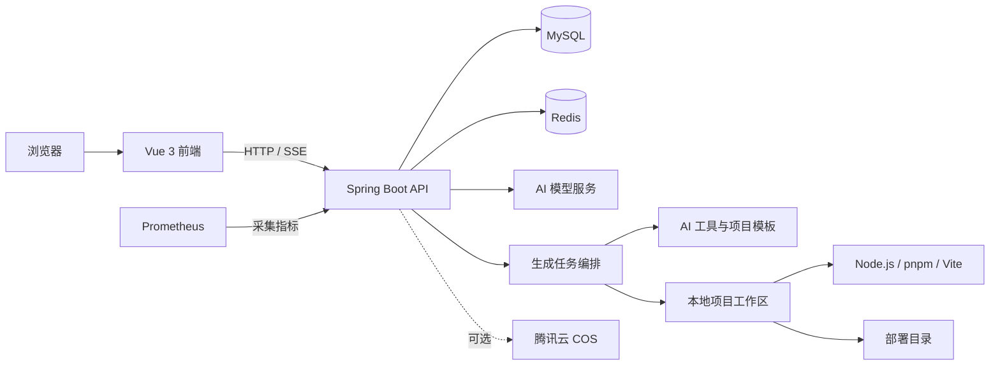

<div align="center">

<h1>🚀 Rush AI Code Mother</h1>

<h3>用一句话描述需求，让 AI 把创意变成真正可运行的应用</h3>

<p>
  <strong>智能生成 · 持续修改 · 实时预览 · 自动验证 · 一键部署</strong>
</p>

<p>
  
  
  
  
  
</p>

<p>
  <a href="#-项目简介">项目简介</a> ·
  <a href="#-为什么选择-rush-ai-code-mother">核心亮点</a> ·
  <a href="#快速开始">快速开始</a> ·
  <a href="#系统架构">系统架构</a> ·
  <a href="#api-模块概览">API 概览</a>
</p>

</div>

---

## ✨ 项目简介

> **Rush AI Code Mother 不只是一个代码生成器，更是一条从创意到产品的智能开发流水线。** 你只需用自然语言描述想法，它就能自动理解需求、选择合适的工程模式、生成并持续修改代码，完成依赖安装、质量检查、实时预览与一键部署，让一个模糊的灵感快速成长为真正可运行、可迭代、可交付的应用。

项目采用前后端分离架构：后端基于 Spring Boot 3 与 LangChain4j，前端基于 Vue 3、TypeScript 和 Ant Design Vue。仓库内同时提供多种项目模板，并包含代码生成、文件编辑、依赖安装、构建校验、Dev Server 预览、部署和失败恢复等完整流程。

## 🌟 为什么选择 Rush AI Code Mother？

| 🧠 不止“生成代码” | 🛠️ 面向真实工程 | 🚀 从创意直接到交付 |
| :---: | :---: | :---: |
| 理解需求并智能选择生成模式，通过连续对话持续完善应用 | 自动处理文件、依赖、构建、测试、诊断与失败恢复 | 生成结果可实时预览、在线修改、打包下载并快速部署 |

<div align="center">

<h3>从一句需求到应用上线</h3>

<p><strong>💡 描述想法　→　🧭 智能路由　→　⚙️ 工程生成　→　✅ 质量验证　→　👀 实时预览　→　🚀 一键部署</strong></p>

</div>

> [!TIP]
> 无论是一个精美落地页、Vue 管理后台、移动端站点，还是带后端与数据库能力的全栈应用，都可以从同一个自然语言入口开始创建。

## 🎯 功能特性

### AI 应用生成

- 通过自然语言描述创建应用，并使用 SSE 实时返回生成过程
- SSE 主进度统一为理解、规划、实现、可预览、校验、待确认和已交付七个用户阶段，不暴露内部 Agent 和路由细节
- 支持原生 HTML、原生多文件、Vue 工程、后端工程和全栈工程模式
- 根据需求复杂度选择或升级生成模式，避免后续编辑导致工程能力降级
- 支持提示词优化、连续对话修改、停止生成和历史记录查询
- 内置文件读写、项目搜索、依赖分析、构建测试、差异摘要和快照回滚等工具
- 对生成结果执行依赖安装、代码检查、构建验证与自动修复

### 预览与部署

- 为生成项目启动隔离的本地 Dev Server
- 通过后端鉴权代理访问实时预览，避免直接暴露内部端口
- 支持生成代码文件浏览、在线保存和项目打包下载
- 支持应用部署、重新同步部署内容和静态资源访问
- 可选接入腾讯云 COS 保存应用封面等资源

### 用户与管理后台

- 用户注册、登录、退出和 Session 管理
- 我的应用、精选应用、应用复制、编辑与删除
- 管理员用户管理、应用管理、聊天记录管理
- AI 模型目录、模型连接测试、启停和分类路由
- 用户积分余额、生成扣费和积分流水
- 生成任务、模型调用、构建结果和性能指标记录

### 工程能力

- MySQL 持久化、Redis Session、Redis 缓存与分布式限流
- Spring Boot Actuator 与 Prometheus 指标输出
- 开发、生产配置分层及生产配置启动校验
- Maven Enforcer 约束 Java 版本与依赖边界
- Vue/Go 等内置项目模板和模板依赖预热
- 单元测试、回归测试和外部依赖测试分组

### 用户进度公共契约

生成链路的公共 SSE 边界由 `orchestration/experience` 模块统一映射。客户端主进度只依赖 `generation_stage` v1 的有限阶段，内部 `agent_event` 仅供诊断使用；审批场景仅保留完成用户决策所需的最小字段。

```text
understanding → planning → implementing → preview_ready → verifying
                                      └→ awaiting_approval
verifying → delivered
```

后端在映射后继续执行公共字段脱敏和单订阅阶段去重，前端只将 `ai_delta` 追加到 AI 回答正文，从而避免工程节点、Agent 名称和内部原因干扰用户。

### 生成完成证据门禁

生成任务进入成功终态前统一执行完成证据校验。同步流水线、Heavy 最终化和 Agent Runtime 均不能仅凭流程返回或模型停止调用工具判定成功，而必须满足：

- 已形成可机器校验的意图覆盖证据；
- 已确认有效工作区变更，或提供带非空原因的结构化“无需修改”证明；
- 已完成冻结执行计划要求的 FAST、BUILD 或 EXPERT 验证步骤；
- 会话未取消、未超时，执行上下文仍可继续，且持久任务栅栏与租约仍属于当前执行。

证据不足时链路失败关闭，不发布工作区、不提交成功终态、不按成功计费，也不发送完成事件。内部证据、验证步骤和租约诊断仅保留在服务端制品、日志与测试中；用户侧仍只看到 `verifying`、`delivered` 等稳定公共阶段。

## 技术栈

### 后端

| 分类 | 技术 |
| --- | --- |
| 基础框架 | Java 21、Spring Boot 3.5 |
| AI 能力 | LangChain4j、OpenAI Chat Completions 兼容协议 |
| 数据访问 | MyBatis-Flex、MySQL |
| 会话与缓存 | Spring Session、Redis、Redisson、Caffeine |
| 接口文档 | SpringDoc OpenAPI、Knife4j |
| 监控 | Spring Boot Actuator、Micrometer、Prometheus |
| 浏览器能力 | Selenium、WebDriverManager |
| 对象存储 | 腾讯云 COS（可选） |
| 构建测试 | Maven Wrapper、JUnit、Mockito |

### 前端

| 分类 | 技术 |
| --- | --- |
| 核心框架 | Vue 3、TypeScript |
| UI | Ant Design Vue |
| 状态与路由 | Pinia、Vue Router |
| 构建工具 | Vite |
| 网络请求 | Axios |
| 内容展示 | Markdown-It、Highlight.js |
| 质量工具 | ESLint、Prettier、Vitest、vue-tsc |

## 系统架构



## 项目结构

```text
.
├── src/main/java/com/rush/rushaicodemother
│   ├── ai/                         # AI 意图识别、护栏、消息模型与工具
│   ├── application/                # 应用层用例与业务入口
│   ├── controller/                 # REST API 与 SSE 接口
│   ├── core/                       # 代码生成、解析、保存和工程构建
│   ├── infrastructure/             # 文件系统、Git、进程及诊断基础设施
│   ├── orchestration/              # 创建、编辑、校验、恢复和任务编排
│   ├── service/                    # 用户、应用、模型、部署等领域服务
│   ├── mapper/                     # MyBatis-Flex Mapper
│   ├── model/                      # DTO、实体、枚举与视图对象
│   ├── config/                     # Spring 与生产环境配置
│   └── RushAiCodeMotherApplication.java
├── src/main/resources
│   ├── application*.yml            # 公共、开发和生产配置
│   ├── mapper/                     # MyBatis XML
│   ├── prompt/                     # AI 系统提示词
│   ├── agent-skills/               # 生成代理可用技能
│   └── project-templates/          # Vue、Go 等项目模板
├── rush-ai-code-mother-frontend/   # Vue 3 管理端与用户端
├── sql/create_table.sql            # 数据库初始化脚本
├── docs/                           # 补充文档
├── tmp/                            # 默认运行时临时目录
├── pom.xml                         # Maven 配置
└── mvnw / mvnw.cmd                 # Maven Wrapper
```

## 环境要求

开始前请准备以下环境：

- JDK 21 或更高版本
- MySQL
- Redis
- Node.js
- pnpm

其中 Node.js 与 pnpm 不仅用于运行本仓库前端，也会被后端用于安装和构建 AI 生成的前端项目。生产环境应固定 Node.js、pnpm 的版本，并确保后端运行账号可以从 `PATH` 中找到 `node` 和 `pnpm`。

## 快速开始

以下命令以 Windows PowerShell 为例；Linux/macOS 可将 `mvnw.cmd` 替换为 `./mvnw`，环境变量按当前 Shell 语法设置。

### 1. 初始化数据库

启动 MySQL 后执行：

```powershell
mysql -u root -p
```

进入 MySQL 客户端后执行：

```sql
source sql/create_table.sql;
```

脚本会创建并使用 `rush_ai_code_mother` 数据库，同时初始化用户、应用、聊天记录、AI 模型和生成追踪等相关表。

已有数据库升级时，不得重新执行完整初始化脚本。请先备份数据库，再按照
`sql/migrations/README.md` 记录的顺序执行尚未应用的迁移文件。迁移失败必须停止发布，
尤其不得通过清空积分流水或删除完整性约束绕过账务数据问题。

### 2. 启动 Redis

开发环境默认连接：

```text
Host: localhost
Port: 6379
Database: 7
```

如本地 Redis 配置不同，请通过环境变量或本地配置文件覆盖。

### 3. 配置后端

开发环境默认使用 Maven `dev` Profile。推荐通过环境变量提供本地数据库和 Redis 配置：

```powershell
$env:MYSQL_URL='jdbc:mysql://localhost:3306/rush_ai_code_mother?useUnicode=true&characterEncoding=utf8&serverTimezone=Asia/Shanghai'
$env:MYSQL_USERNAME='root'
$env:MYSQL_PASSWORD='你的数据库密码'
$env:REDIS_HOST='localhost'
$env:REDIS_PORT='6379'
$env:REDIS_DATABASE='7'
$env:REDIS_PASSWORD=''
```

也可以创建不会提交到 Git 的 `src/main/resources/application-local.yml`：

```yaml
spring:
  datasource:
    username: root
    password: your-password
  data:
    redis:
      host: localhost
      port: 6379
      database: 7
      password: ""
```

使用本地覆盖配置启动时：

```powershell
$env:SPRING_PROFILES_ACTIVE='dev,local'
.\mvnw.cmd spring-boot:run
```

如果不需要额外的 `local` Profile，直接运行：

```powershell
.\mvnw.cmd spring-boot:run
```

后端默认地址为 `http://localhost:8123/api`。

`MYSQL_*`、`REDIS_*`、`CORS_ALLOWED_ORIGINS` 和 `CODE_DEPLOY_HOST` 的变量名在开发和生产下保持一致：开发由
`application-dev.yml` 提供本机兜底值，生产由 `ProfileDefaultsEnvironmentPostProcessor` 映射到对应的 Spring 属性且不提供
任何兜底取值，未注入时会在创建 Bean 前拒绝启动。

大规模代码生成提交限制为单次 `20000` 个去重文件、Git pathspec 清单 `2 MiB`，已固定为 `GenerationCommitProperties` 常量，
不再接受环境变量调整。生产环境完整变量说明见 `docs/backend-production-configuration.md`。

### 4. 创建管理员并配置 AI 模型

系统不在代码库中内置真实 AI 密钥。首次启动后：

1. 在前端注册一个普通用户。
2. 在本地数据库中将该账号设置为管理员：

```sql
update user
set userRole = 'admin'
where userAccount = 'your-account';
```

3. 重新登录，进入“模型管理”页面。
4. 根据模型目录填写 API Base URL、模型 ID 和 API Key。
5. 先执行连接测试，再启用对应的生成、推理或路由模型。

AI 模型 API Key 会在写入时进行 AES-256-GCM envelope encryption；数据库只保存密文引用、HMAC 指纹和 KEK ID。生产环境必须通过 Secret Manager 注入独立的 `AI_MODEL_SECRET_ACTIVE_KEY` 与 `AI_MODEL_SECRET_FINGERPRINT_KEY`，不得把 API Key 或主密钥写入 `application.yml`、日志或 Git。

### 5. 启动前端

打开新的终端：

```powershell
cd rush-ai-code-mother-frontend
pnpm install
pnpm dev
```

前端默认运行在 `http://localhost:5173`，开发服务器会将 `/api` 请求代理到 `http://localhost:8123`。

### 6. 验证服务

| 服务 | 地址 |
| --- | --- |
| 前端 | `http://localhost:5173` |
| 后端 API 根路径 | `http://localhost:8123/api` |
| 兼容进程存活检查 | `http://localhost:8123/api/health/` |
| Actuator 存活探针 | `http://localhost:8123/api/actuator/health/liveness` |
| Actuator 就绪探针 | `http://localhost:8123/api/actuator/health/readiness` |
| Actuator 聚合健康检查 | `http://localhost:8123/api/actuator/health` |
| Knife4j（开发环境） | `http://localhost:8123/api/doc.html` |
| OpenAPI JSON（开发环境） | `http://localhost:8123/api/v3/api-docs` |
| Prometheus 指标 | `http://localhost:8123/api/actuator/prometheus` |

生产 Profile 默认关闭 OpenAPI 与 Knife4j，并隐藏健康检查内部细节。

## 常用命令

### 后端

```powershell
# 启动开发环境
.\mvnw.cmd spring-boot:run

# 运行默认测试集
.\mvnw.cmd test

# 运行生成主链路发布冒烟
.\mvnw.cmd -Pgeneration-release-smoke test

# 编译
.\mvnw.cmd -DskipTests compile

# 构建开发产物
.\mvnw.cmd clean package

# 构建生产产物
.\mvnw.cmd -Pprod clean package

# 启动生产 JAR
java -jar target/rush-ai-code-mother-0.0.1-SNAPSHOT.jar
```

生成主链路发布冒烟是无外部模型、Redis、MySQL 依赖的进程内门禁，固定覆盖创建、轻量编辑、复杂编辑、取消、审批、幂等和 SSE 续传七类场景。默认测试仍会运行这些用例，并额外排除标记为 `external` 和 `integration` 的测试，避免本地测试意外访问真实第三方服务。Redis 持久化契约可使用隔离实例显式验证：

```powershell
docker run --rm -d --name ai-mother-redis-it -p 56379:6379 redis:7-alpine
.\mvnw.cmd -Pintegration-test '-Dtest=RedisChatMemoryRestartIntegrationTest,RedisGenerationRuntimeIntegrationTest' '-Dintegration.redis.host=127.0.0.1' '-Dintegration.redis.port=56379' test
docker stop ai-mother-redis-it
```

Milvus 长期记忆契约使用与 CI 相同的隔离服务，验证数据面健康以及真实写入、召回和按应用删除：

```powershell
docker compose --project-name ai-mother-milvus-it --file docker/milvus/compose.ci.yml up --detach --wait --wait-timeout 300
.\mvnw.cmd -Pdev,external-test '-Dtest=MilvusConnectionExternalTest,MilvusLongTermMemoryStoreExternalTest,MilvusMemorySpringWiringTest' '-DmilvusUri=http://127.0.0.1:19530' test
docker compose --project-name ai-mother-milvus-it --file docker/milvus/compose.ci.yml down --volumes --remove-orphans
```

### 前端

```powershell
cd rush-ai-code-mother-frontend

# 本地开发
pnpm dev

# 类型检查并构建
pnpm build

# 单元测试
pnpm test

# ESLint 检查并自动修复
pnpm lint

# 格式化 src 目录
pnpm format

# 预览生产构建
pnpm preview
```

## 核心配置

后端配置只有 `application.yml`（公共/默认）和 `application-dev.yml`（开发）两个文件；`prod` 与 `benchmark-worker` 的固定取值由
`ProfileDefaultsEnvironmentPostProcessor` 以 Java 常量注入。内部策略参数（超时、并发、条带锁、资源上限、预算、发布门禁阈值）以及
产品内部约定（Redis 键前缀与 Stream 命名、容器内挂载点、Database 资源约定、Prompt 清单与灰度盐值）已统一下沉为各 `*Properties`
类的 `public static final` 常量，不再从环境变量读取；仍可外部配置的是密钥与凭据、主机与 URL、容器镜像与 CPU/内存、端口区间、
文件系统根目录、传输实现、功能开关、工具链路径和可观测性端点。多环境共用 Redis 时通过 `REDIS_DATABASE` 编号隔离。

| 环境变量 | 默认值 | 说明 |
| --- | --- | --- |
| `SERVER_PORT` | `8123` | 后端端口 |
| `MYSQL_URL` | 开发为本机 `rush_ai_code_mother` | MySQL JDBC 地址；生产必填且无兜底值 |
| `MYSQL_USERNAME` | 开发 `root` | MySQL 用户名；生产必填，禁止使用 `root` |
| `MYSQL_PASSWORD` | 开发配置内有本地默认值 | 生产必填，必须通过 Secret 注入 |
| `REDIS_HOST` | 开发 `localhost` | Redis 主机；生产必填且无兜底值 |
| `REDIS_PORT` | `6379` | Redis 端口 |
| `REDIS_DATABASE` | 开发 `7`、生产 `0` | Redis Database |
| `REDIS_PASSWORD` | 开发为空 | Redis 密码；生产必填，必须通过 Secret 注入 |
| `GENERATION_EVENT_STREAM_TRANSPORT` | 开发 `local`、生产 `redis` | 跨实例生成事件传输；生产环境必须使用 Redis Streams |
| `GENERATION_EVENT_STREAM_DELTA_COALESCING_ENABLED` | `true` | 是否仅在 Redis 共享传输边界合并相邻 AI 文本增量；首段、工具和终态事件仍立即写入。合并窗口 `40ms` 与缓冲上限 `2048` 字符已固定为 `GenerationEventStreamProperties` 常量 |
| `MILVUS_MEMORY_ENABLED` | `false`（生产强制 `true`） | 是否启用 Milvus 长期语义记忆；关闭时 generation outbox 不会把进程内缓存误标为持久化成功 |
| `MILVUS_URI` | 空 | Milvus SDK 的 gRPC/HTTPS 入口；生产必填，不能填写 REST `9091` 或 etcd `2379` 地址 |
| `MILVUS_TOKEN` | 空 | Milvus 认证 token；生产通过 Secret 注入 |
| `MILVUS_AUTHENTICATION_REQUIRED` | `false`（生产强制 `true`） | 是否要求非空 token |
| `MILVUS_TLS_REQUIRED` | `false`（生产强制 `true`） | 是否只允许 HTTPS Milvus endpoint |
| `MILVUS_DATABASE` | `default` | Milvus database 名称 |
| `MILVUS_MEMORY_COLLECTION` | `generation_memory_v2` | 显式版本化的长期记忆 collection；不兼容旧 schema 时禁止原地复用 |
| `MILVUS_VERIFY_ON_STARTUP` | `false`（生产强制 `true`） | 启动时是否 fail-fast 验证 Milvus 完整契约。建连 `3s`、RPC `5s`、就绪等待 `60s`、重校验 `30s`、回退缓存 `5000` 条且保留 `12h`、召回 `6` 条、最低分数 `0.45` 已固定为 `MilvusMemoryProperties` 常量 |
| `GENERATION_MEMORY_CONTEXT_PARALLEL_READS_ENABLED` | `false` | 是否并行读取最近任务、构建日志和长期语义记忆；发布前必须用 Benchmark 证明首 Token 收益且无质量回退 |
| `GENERATION_MEMORY_CONTEXT_PREPARATION_OVERLAP_ENABLED` | `false` | 是否让记忆构建与 Planner、模板准备和项目索引重叠执行；仅允许经 Benchmark 灰度开启。只读并发 `12`、读取超时 `10s`、准备并发 `4`、汇合上限 `30s`、关闭等待 `10s` 已固定为 `GenerationMemoryContextProperties` 常量 |
| `GENERATION_MEMORY_OUTBOX_ENABLED` | `true` | generation memory 与应用删除 durable outbox 开关；生产强制开启。扫描 `30s`、单轮 claim `50`、最大尝试 `10`、租约 `2m`、退避 `30s`～`1h` 已固定为 `GenerationMemoryOutboxProperties` 常量 |
| `CORS_ALLOWED_ORIGINS` | 开发为 `http://localhost:5173` | 生产必填的前端 Origin 白名单；只允许无通配符、非 loopback 的 HTTPS Origin |
| `CODE_DEPLOY_HOST` | `http://localhost:91` | 已部署应用的公开访问根地址 |
| `code.output-root-dir` | `tmp/code_output` | AI 生成工作区根目录；配置属性或 `-Dcode.output-root-dir`，不是环境变量 |
| `code.deploy-root-dir` | `tmp/code_deploy` | 已部署应用视图根目录；配置属性或 `-Dcode.deploy-root-dir` |
| `code.snapshot-root-dir` | `tmp/code_snapshot` | 生成事务快照根目录；必须与工作区和部署根目录隔离 |
| `COS_ENABLED` | `false` | 是否启用腾讯云 COS |
| `TEMPLATE_PRE_WARM_ENABLED` | 开发和生产默认开启 | 是否在启动时预热模板依赖；预热并发 `2` 与可选模板集合已固定为 `TemplatePreWarmProperties` 常量 |
| `GO_TOOLCHAIN_GO_EXECUTABLE` | `go` | 受控 Go 构建测试使用的可执行文件名或绝对路径 |
| `GENERATED_CODE_SANDBOX_DEPENDENCY_NETWORK` | `bridge`（生产禁止） | 依赖安装专用 Docker internal 网络；生产必须预创建且只连接可信 registry mirror，生成容器不得拥有默认外网路由 |
| `APP_GENERATED_CODE_SANDBOX_CONTAINER_DEPENDENCY_REGISTRY_URL` | 非生产为 `https://registry.npmjs.org/` | Spring 属性 `app.generated-code-sandbox.container.dependency-registry-url` 的环境变量形式；生产必须显式配置为 internal 网络中的可信 registry mirror，禁止凭据、IP、查询参数和回环地址 |
| `GENERATED_CODE_SANDBOX_GO_BUILD_TMPFS_SIZE` | `512m` | 容器内受控离线 `go build/install/run/test` 专用可执行 tmpfs 上限；普通 `/tmp` 仍为 `noexec` |
| `GENERATION_BENCHMARK_BROWSER_GRADING_ENABLED` | `false` | 浏览器 Runtime/Visual 评分开关；专用发布门禁 Worker 必须开启 |
| `GENERATION_BENCHMARK_BACKEND_GRADING_ENABLED` | `false` | 后端与全栈真实运行时评分开关；专用发布门禁 Worker 必须开启 |
| `GENERATION_BENCHMARK_BACKEND_PORT_RANGE_START` | `19000` | 节点本地后端评分端口池起始值 |
| `GENERATION_BENCHMARK_BACKEND_PORT_RANGE_END` | `19999` | 节点本地后端评分端口池结束值 |
| `GENERATION_BENCHMARK_BACKEND_WORKSPACE_ROOT` | JVM 临时目录下的 `ai-code-mother/benchmark-backend-runtime` | 一次性候选副本和启动就绪检查目录 |
| `GENERATION_BENCHMARK_GRADER_FINGERPRINT` | `generation-benchmark-graders-v6` | 当前评分器协议指纹；评分代码、数据集和证据消费者必须同步升级 |
| `GENERATION_BENCHMARK_WORKER_OUTPUT_FILE` | Worker 启用时必填 | 原子写入的 CI 结果 JSON 绝对路径或工作目录相对路径 |
| `GENERATION_BENCHMARK_WORKER_CANDIDATE_TYPE` | Worker 启用时必填 | `AI_MODEL_ENABLE` 或 `PROMPT_RELEASE` |
| `GENERATION_BENCHMARK_WORKER_MODEL_ID` | `0` | 模型启用候选的数据库编号；Prompt 候选必须保持 `0` |
| `GENERATION_BENCHMARK_WORKER_PROMPT_KEY` | 空 | Prompt 发布候选的 Prompt Key |
| `GENERATION_BENCHMARK_WORKER_STABLE_VERSION` | 空 | Prompt 发布候选的稳定版本 |
| `GENERATION_BENCHMARK_WORKER_CANARY_VERSION` | 空 | 灰度比例大于 `0` 时必填的灰度版本 |
| `GENERATION_BENCHMARK_WORKER_CANARY_PERCENTAGE` | `0` | Prompt 候选灰度比例，范围 `0` 到 `100` |
| `AI_LOG_REQUESTS` | `false` | 是否记录生成模型请求 |
| `AI_LOG_RESPONSES` | `false` | 是否记录生成模型响应 |
| `AI_ROUTING_LOG_REQUESTS` | `false` | 是否记录路由模型请求 |
| `AI_ROUTING_LOG_RESPONSES` | `false` | 是否记录路由模型响应 |
| `GENERATION_ROUTING_SHADOW_ENABLED` | `false` | 开启后仅执行结构化意图 Challenger 并记录对比指标，不改变主路由；完成 Benchmark 验证前不得开启生产切流。 |
| `AI_LOCAL_FIRST_HEAVY_ROUTING_ENABLED` | `true` | HEAVY 目标类型是否优先使用高置信本地规则；关闭后恢复为所有 HEAVY 请求调用类型路由模型 |
| `AI_FIRST_TOKEN_HEDGE_ENABLED` | `false` | 是否为任务级限时流式请求启用首 Token 对冲；影子候选延迟 `3s`、要求不同供应商已固定为 `AiModelRuntimeProperties` 常量 |
| `GENERATION_TASK_SNAPSHOT_ENABLED` | `true` | 是否保存本机编排诊断快照；关闭后不影响数据库生成状态 |
| `GENERATION_TASK_SNAPSHOT_ROOT_DIRECTORY` | `tmp/orchestration_tasks` | 编排诊断快照根目录；单快照 `2 MiB`、单应用 `100` 份、保留 `7d`、写锁条带 `64` 已固定为 `GenerationTaskSnapshotProperties` 常量 |
| `GENERATION_REPLAY_SAFE_START_CHECKPOINT_ELISION_ENABLED` | `false` | 是否省略显式可重放 DAG 节点的开始检查点；必须先通过 Benchmark 并灰度开启 |
| `GENERATION_REPLAY_SAFE_COMPLETION_CHECKPOINT_COALESCING_ENABLED` | `false` | 是否合并连续可重放节点的完成检查点；只能与开始检查点省略同时启用，强制持久化间隔固定为 `4` |
| `EDIT_STATE_ENABLED` | `true` | 是否将连续改修文件召回状态保存到本机；关闭后仍保留有界进程内缓存 |
| `EDIT_STATE_ROOT_DIRECTORY` | `tmp/edit_state` | 编辑状态本地文件根目录；缓存 `1000` 应用、访问过期 `2h`、磁盘保留 `24h`、持久化 `10000` 应用、单文件 `1 MiB`、最近编辑 `20`/文件 `50`/验证 `20`、锁条带 `64` 已固定为 `EditStatePersistenceProperties` 常量 |

以下策略已经固定为代码常量，不再接受环境变量覆盖：生成上下文裁剪、结构化上下文包预算、编辑定位、补丁资源边界、AI 工具工作区、
工具循环与审批治理、Agent 生产率治理、路由 SLA 与执行预算、阶段准入窗口、模型运行时超时与容量额度、限流连接池与超时、工作区与
产物资源上限、模板物化、依赖安装与项目命令超时、Dev Server 运行时与代理限制、Milvus 超时与召回、记忆上下文与 outbox 时序、
任务队列时序、编排快照与编辑状态边界、积分预扣估算、Redis 缓存 TTL 以及 Benchmark 发布门禁阈值。
选定基线、对应的 `*Properties` 类和调整入口见 [后端生产环境配置基线](docs/backend-production-configuration.md)，剩余可配置的
生产变量也在该文档中维护。

专用 Benchmark Worker 必须同时开启 Browser 与 Backend grading。数据集 `2.1.0` 的全部 `32` 条任务都要求真实 Runtime 证据，Vue 与全栈共 `25` 条任务还要求 Visual 证据。Backend grading 开启后，Worker 会在接收任务前通过当前沙箱离线编译并测试内置 Go+SQLite 模板，同时验证一次性工作区可创建和清理；生产环境推荐使用摘要固定且已验证的容器镜像，Host-Local 必须提供完整 Go SDK 和离线模块缓存。

### 候选 Benchmark Worker

Worker 必须使用与发布控制面相同的已提交制品，并按 `prod,benchmark-worker` 的顺序激活 profile。后一个 profile 会关闭 Web Server、普通后台调度、Redis 任务消费者和跨节点事件流；模型池和 Prompt bundle 在整轮评测前冻结，任何数据库候选或依赖状态漂移都会拒绝签发证据。模型启用候选会在对应模型类型内置于首选位置，并且必须在完整门禁执行窗口内观测到至少一次真实 provider 请求；窗口外请求不计数。物理请求次数进入 HMAC 证据签名协议 `v2`，入库与发布验签会再次校验。

模型启用候选示例：

```powershell
$env:SPRING_PROFILES_ACTIVE = "prod,benchmark-worker"
$env:GENERATION_BENCHMARK_WORKER_OUTPUT_FILE = "D:\benchmark\model-42.json"
$env:GENERATION_BENCHMARK_WORKER_CANDIDATE_TYPE = "AI_MODEL_ENABLE"
$env:GENERATION_BENCHMARK_WORKER_MODEL_ID = "42"
java -jar .\target\rush-ai-code-mother-0.0.1-SNAPSHOT.jar
```

Prompt 发布候选示例：

```powershell
$env:SPRING_PROFILES_ACTIVE = "prod,benchmark-worker"
$env:GENERATION_BENCHMARK_WORKER_OUTPUT_FILE = "D:\benchmark\prompt-v2.json"
$env:GENERATION_BENCHMARK_WORKER_CANDIDATE_TYPE = "PROMPT_RELEASE"
$env:GENERATION_BENCHMARK_WORKER_PROMPT_KEY = "codegen-vue-project"
$env:GENERATION_BENCHMARK_WORKER_STABLE_VERSION = "v2"
$env:GENERATION_BENCHMARK_WORKER_CANARY_VERSION = ""
$env:GENERATION_BENCHMARK_WORKER_CANARY_PERCENTAGE = "0"
java -jar .\target\rush-ai-code-mother-0.0.1-SNAPSHOT.jar
```

以上命令仍需注入完整生产数据库、Redis、Milvus、模型密钥、证据签名密钥、Chrome/ChromeDriver 和容器沙箱配置。Worker 通过后会在同一控制数据库中完成 envelope 签名、验签和证据入库，并将 `evidenceId`、`candidatePhysicalRequestCount` 与完整报告按结果 schema `v2` 原子写入结果文件。退出码 `0` 表示证据已通过并入库，`2` 表示评测完整但门禁拒绝，`1` 表示配置、执行、身份漂移、候选零调用或证据链发生故障。CI 只能把退出码 `0` 视为可晋升。

上下文包预算已由字符比例估算切换为 tokenizer-backed 计数，并整体固定为 `AiContextPackBudgetProperties` 常量
（常规生成 `2000` token、自动修复 `1500` token、tokenizer `gpt-4o`、安全余量 `1.15`），旧变量
`AI_CONTEXT_PACK_*` 不再读取。历史记忆、近期任务、构建日志和当前错误均以
untrusted evidence 边界进入模型输入，结构控制标记会被中和；模型调用 provenance 只持久化校验后的
上下文包摘要和有界元数据，不复制原始提示词、仓库内容或记忆正文。

### 长期语义记忆

长期记忆使用 `tenantId + appId` 作为授权边界，`userId` 仅保留来源和审计语义。默认
`generation_memory_v2` collection 禁用 dynamic field，使用应用分配的 SHA-256 主键、
`AUTOINDEX + COSINE`、强一致读取，并持久化 embedding model/version 与 row schema；搜索 filter
和结果解码会双重核验租户、应用和 embedding 契约。collection、字段、维度、主键、索引或 load
状态不兼容时会 fail-closed，不会尝试危险的原地兼容。

`V20260721_1__semantic_memory_production_contract.sql` 建立带租约的 generation/deletion outbox，
`V20260721_2__semantic_memory_v2_reindex_contract.sql` 增加关系库索引契约版本。历史 v1 任务会按新契约
自动重新 claim，并获得独立的重试预算，无需批量清空 `memoryIndexedAt`。应用删除会在同一 MySQL
事务内先写 deletion outbox，再删除关系数据；Milvus 删除由多实例 worker 幂等执行。生产发布和告警
要求见 [后端生产环境配置基线](docs/backend-production-configuration.md)。

## 代码生成模式

| 模式 | 标识 | 适用场景 |
| --- | --- | --- |
| 原生 HTML | `html` | 单页原型或简单静态页面 |
| 原生多文件 | `multi_file` | 分离 HTML、CSS、JavaScript 的站点 |
| Vue 工程 | `vue_project` | 组件化前端应用 |
| 后端工程 | `backend_project` | API、数据处理等服务端项目 |
| 全栈工程 | `full_stack_project` | 同时包含前端、后端和数据能力的完整应用 |

内置模板位于 `src/main/resources/project-templates/`，目前包含 Vue 基础站点、管理后台、移动端、落地页以及 Go + SQLite 后端模板。新增模板时应同时维护模板清单、构建约束和对应测试。

模板 Bootstrap 仅接受内置模板清单中的标识，并在目标目录同级的 staging 目录中完成受限流式复制和可选依赖预热；全部步骤成功后才发布最终工作区，失败或并发竞争不会暴露半成品目录。模板资源和预热依赖复制统一遵守文件数、单文件大小、总字节数、路径长度、目录深度以及符号链接限制。

## 运行时目录

默认情况下，后端以仓库根目录作为运行基准目录：

```text
tmp/
├── code_output/            # AI 生成工作区，不作为公开静态资源目录
├── code_deploy/            # 已提交部署视图，由 /api/static/{deployKey}/... 读取
├── code_snapshot/          # 生成代码事务快照
└── orchestration_tasks/    # 本机编排诊断快照
```

可以通过 JVM 系统参数覆盖：

```powershell
java `
  -Dcode.base-dir='D:\runtime\ai-code-mother' `
  -Dcode.tmp-root-dir='D:\runtime\ai-code-mother\tmp' `
  -Dcode.output-root-dir='D:\runtime\ai-code-mother\output' `
  -Dcode.deploy-root-dir='D:\runtime\ai-code-mother\deploy' `
  -Dcode.snapshot-root-dir='D:\runtime\ai-code-mother\snapshot' `
  -Dcode.orchestration-task-root-dir='D:\runtime\ai-code-mother\orchestration-tasks' `
  -Dcode.edit-state-root-dir='D:\runtime\ai-code-mother\edit-state' `
  -jar target/rush-ai-code-mother-0.0.1-SNAPSHOT.jar
```

生产环境应为后端运行账号配置最小化的目录权限，并避免让生成目录通过符号链接指向工作区之外。

Dev Server 使用 `dev_server_session` 持久化注册表实现跨实例唯一占用、用户级全局配额、进程租约和 fencing。生产环境必须为每个部署节点配置稳定且唯一的 `DEV_SERVER_NODE_ID`。节点或 JVM 异常退出后，恢复任务会在租约过期后按持久化的 sandbox resource ID 幂等清理 Dev Server 与 preview gateway 容器；不得用进程内 `Map` 或端口记录代替该所有权契约。

生成会话注册表使用固定条带锁，不会为每个历史应用永久保留锁对象；活动会话和短期 SSE 回放会话共享显式总容量。已完成轻量会话只写入过期时间，由单个固定周期任务批量清理，不会为每次完成创建独立延迟任务。多实例容量分别计算，跨实例生成所有权仍以数据库租约为准。

生产 Redis 事件流只合并相邻且不带结构化数据的 `AI_DELTA`。第一段文本立即写入；工具、阶段、错误、完成和关闭都是强制顺序边界。异步冲刷失败会保留缓冲内容并最多重试 3 次，重试耗尽后由下一顺序边界再次冲刷。该策略不改变本机会话、trace、短期记忆和最终生成文件；Redis 写入次数、耗时与合并规模分别通过 `generation_event_stream_redis_appends_total`、`generation_event_stream_redis_append_duration_seconds`、`generation_event_stream_delta_inputs_total`、`generation_event_stream_delta_flushes_total`、`generation_event_stream_delta_events_per_flush` 和 `generation_event_stream_delta_chars_per_flush` 监控。

编排任务快照只用于节点本地诊断，不是任务生命周期的权威数据源；应用生成所有权、租约和 trace 状态以数据库为准。快照采用同目录临时文件原子替换，并受单文件大小、单应用数量和保留期限约束。多实例部署应使用各节点独立目录；只有共享存储已经保证单写者语义时才允许共享该目录。

连续改修编辑状态同样是节点本地的文件召回优化，不是应用内容或任务状态的权威数据源。状态只保存安全任务标识、规范化相对路径、成功状态和时间戳，不保存原始用户消息、失败原因或验证详情；磁盘写入采用强制刷盘和原子替换，并同时限制缓存容量、文件大小、应用数量、记录数量和保留期限。多实例默认使用节点独立目录。旧版本用户主目录下的 `.ai-code-edit-state` 文件不会再读取，可在确认无需回滚旧版本后删除。

## API 模块概览

所有接口默认位于 `/api` 上下文路径下：

| 模块 | 路径前缀 | 说明 |
| --- | --- | --- |
| 用户 | `/user` | 注册、登录、用户管理和积分调整 |
| 应用 | `/app` | 应用增删改查、复制和精选列表 |
| 代码生成 | `/app/chat/gen/code` | 创建生成任务、SSE 订阅与停止任务 |
| 代码文件 | `/app/code` | 文件树、读取、保存和下载 |
| Dev Server | `/app/dev-server` | 启动、停止、状态和预览代理 |
| 部署 | `/app/deploy` | 部署与同步部署内容 |
| 聊天记录 | `/chatHistory` | 应用聊天历史与管理员查询 |
| AI 模型 | `/ai-model` | 模型目录、配置、测试和启停 |
| 生成性能 | `/generation-performance` | 管理员生成性能统计、任务延迟归因与路由分段延迟画像 |

完整请求参数和响应结构请以开发环境 Knife4j/OpenAPI 文档为准。

### 生成延迟诊断接口（管理员）

| 接口 | 用途 |
| --- | --- |
| `GET /generation-performance/admin/tasks/{taskId}/latency-ledger` | 单任务的不重复计数挂钟归因 |
| `GET /generation-performance/admin/routes/{route}/duration-profile` | 路由级 `(stage, category)` 维度的历史耗时分位数 |
| `GET /generation-performance/admin/routes/{route}/latency-segments` | 路由级 `preparation/context/model/verification/publish` 五段 p50/p90/p99 及各段占任务 p90 的比例 |

分段接口用于判断「准备阶段是否值得并行」。`PIPELINE` 类别是包裹子跨度的父跨度，不计入任何分段（否则与子跨度重复计时），但仍计入 `sampleCompletenessPercent` 分母以暴露归类缺口。

`sufficientForParallelDecision` 为 `false` 时**不得据此做并行决策** —— 它要求成功任务样本 ≥ 100 且归类完整率 ≥ 95%，两者任一不足即为假。样本不足会显式暴露，不做静默近似。三个接口均复用既有有界查询与进度缓存参数，不新增配置项、不新建线程池。

## 生产部署注意事项

1. 使用 `-Pprod clean package` 构建生产 JAR，避免携带开发 Profile 或残留增量编译产物。
2. 数据库密码、Redis 密码、AI API Key、COS 密钥等敏感信息必须通过 Secret、环境变量或外部配置注入。
3. 生产节点需要固定 Java、Node.js 和 pnpm 版本，不要在请求处理中临时下载或升级工具链。
4. 反向代理应统一转发 `/api`；已部署静态资源通过 `/api/static/{deployKey}/...` 提供，`code_output` 生成工作区不得直接暴露。
5. 若启用 HTTPS，确保 Session Cookie、安全代理头、CORS Origin 和 `CODE_DEPLOY_HOST` 配置一致。
6. 多实例共享生成目录时，需要在基础设施层保证单写者或补充分布式项目锁。
7. 生产环境默认关闭接口文档，并限制 Actuator、管理接口和预览资源的访问来源。

详细说明见 [docs/backend-production-configuration.md](docs/backend-production-configuration.md)。

## 开发约定

- 新功能应放入职责匹配的模块，避免在 Controller 或单个 Service 中堆积业务逻辑。
- 公共能力优先通过接口、策略或独立服务扩展，保持生成流程对新增模式和工具开放。
- 修改生成、进程、文件系统或部署逻辑时，必须补充边界、异常和回归测试。
- 不要提交真实密钥、本地数据库密码、生成产物、依赖目录或 IDE 私有配置。
- 提交前至少运行受影响模块的测试；涉及前后端契约时同时执行后端测试和前端构建。

## 相关文档

- [后端生产环境配置基线](docs/backend-production-configuration.md)
- [前端说明](rush-ai-code-mother-frontend/README.md)
- [项目模板说明](src/main/resources/project-templates/README.md)
