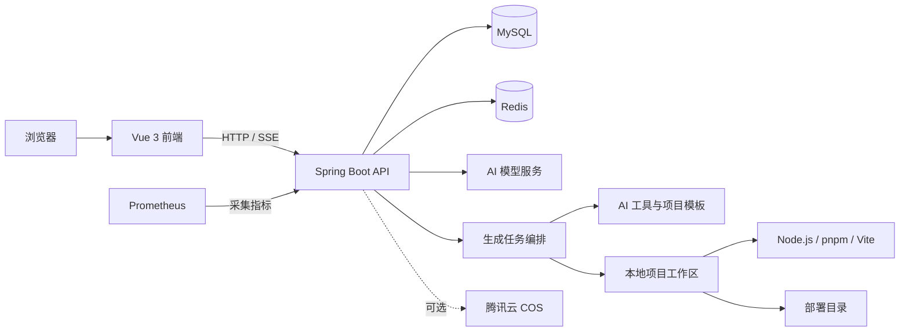

# Rush AI Code Mother

一个面向网站与应用开发场景的 AI 代码生成平台。用户可以通过自然语言创建、持续修改、实时预览并部署应用；管理员可以统一管理用户、应用、对话记录、AI 模型与生成性能数据。

项目采用前后端分离架构：后端基于 Spring Boot 3 与 LangChain4j，前端基于 Vue 3、TypeScript 和 Ant Design Vue。仓库内同时提供多种项目模板，并包含代码生成、文件编辑、依赖安装、构建校验、Dev Server 预览、部署和失败恢复等完整流程。

## 功能特性

### AI 应用生成

- 通过自然语言描述创建应用，并使用 SSE 实时返回生成过程
- 支持原生 HTML、原生多文件、Vue 工程、后端工程和全栈工程模式
- 根据需求复杂度选择或升级生成模式，避免后续编辑导致工程能力降级
- 支持提示词优化、连续对话修改、停止生成和历史记录查询
- 内置文件读写、项目搜索、依赖分析、构建测试、差异摘要和快照回滚等工具
- 对生成结果执行依赖安装、代码检查、构建验证与自动修复

### 预览与部署

- 为生成项目启动隔离的本地 Dev Server
- 通过后端鉴权代理访问实时预览，避免直接暴露内部端口
- 支持生成代码文件浏览、在线保存和项目打包下载
- 支持应用部署、重新同步部署内容和静态资源访问
- 可选接入腾讯云 COS 保存应用封面等资源

### 用户与管理后台

- 用户注册、登录、退出和 Session 管理
- 我的应用、精选应用、应用复制、编辑与删除
- 管理员用户管理、应用管理、聊天记录管理
- AI 模型目录、模型连接测试、启停和分类路由
- 用户积分余额、生成扣费和积分流水
- 生成任务、模型调用、构建结果和性能指标记录

### 工程能力

- MySQL 持久化、Redis Session、Redis 缓存与分布式限流
- Spring Boot Actuator 与 Prometheus 指标输出
- 开发、生产配置分层及生产配置启动校验
- Maven Enforcer 约束 Java 版本与依赖边界
- Vue/Go 等内置项目模板和模板依赖预热
- 单元测试、回归测试和外部依赖测试分组

## 技术栈

### 后端

| 分类 | 技术 |
| --- | --- |
| 基础框架 | Java 21、Spring Boot 3.5 |
| AI 能力 | LangChain4j、OpenAI Chat Completions 兼容协议 |
| 数据访问 | MyBatis-Flex、MySQL |
| 会话与缓存 | Spring Session、Redis、Redisson、Caffeine |
| 接口文档 | SpringDoc OpenAPI、Knife4j |
| 监控 | Spring Boot Actuator、Micrometer、Prometheus |
| 浏览器能力 | Selenium、WebDriverManager |
| 对象存储 | 腾讯云 COS（可选） |
| 构建测试 | Maven Wrapper、JUnit、Mockito |

### 前端

| 分类 | 技术 |
| --- | --- |
| 核心框架 | Vue 3、TypeScript |
| UI | Ant Design Vue |
| 状态与路由 | Pinia、Vue Router |
| 构建工具 | Vite |
| 网络请求 | Axios |
| 内容展示 | Markdown-It、Highlight.js |
| 质量工具 | ESLint、Prettier、Vitest、vue-tsc |

## 系统架构



## 项目结构

```text
.
├── src/main/java/com/rush/rushaicodemother
│   ├── ai/                         # AI 意图识别、护栏、消息模型与工具
│   ├── application/                # 应用层用例与业务入口
│   ├── controller/                 # REST API 与 SSE 接口
│   ├── core/                       # 代码生成、解析、保存和工程构建
│   ├── infrastructure/             # 文件系统、Git、进程及诊断基础设施
│   ├── orchestration/              # 创建、编辑、校验、恢复和任务编排
│   ├── service/                    # 用户、应用、模型、部署等领域服务
│   ├── mapper/                     # MyBatis-Flex Mapper
│   ├── model/                      # DTO、实体、枚举与视图对象
│   ├── config/                     # Spring 与生产环境配置
│   └── RushAiCodeMotherApplication.java
├── src/main/resources
│   ├── application*.yml            # 公共、开发和生产配置
│   ├── mapper/                     # MyBatis XML
│   ├── prompt/                     # AI 系统提示词
│   ├── agent-skills/               # 生成代理可用技能
│   └── project-templates/          # Vue、Go 等项目模板
├── rush-ai-code-mother-frontend/   # Vue 3 管理端与用户端
├── sql/create_table.sql            # 数据库初始化脚本
├── docs/                           # 补充文档
├── tmp/                            # 默认运行时临时目录
├── pom.xml                         # Maven 配置
└── mvnw / mvnw.cmd                 # Maven Wrapper
```

## 环境要求

开始前请准备以下环境：

- JDK 21 或更高版本
- MySQL
- Redis
- Node.js
- pnpm

其中 Node.js 与 pnpm 不仅用于运行本仓库前端，也会被后端用于安装和构建 AI 生成的前端项目。生产环境应固定 Node.js、pnpm 的版本，并确保后端运行账号可以从 `PATH` 中找到 `node` 和 `pnpm`。

## 快速开始

以下命令以 Windows PowerShell 为例；Linux/macOS 可将 `mvnw.cmd` 替换为 `./mvnw`，环境变量按当前 Shell 语法设置。

### 1. 初始化数据库

启动 MySQL 后执行：

```powershell
mysql -u root -p < sql/create_table.sql
```

脚本会创建并使用 `rush_ai_code_mother` 数据库，同时初始化用户、应用、聊天记录、AI 模型和生成追踪等相关表。

### 2. 启动 Redis

开发环境默认连接：

```text
Host: localhost
Port: 6379
Database: 7
```

如本地 Redis 配置不同，请通过环境变量或本地配置文件覆盖。

### 3. 配置后端

开发环境默认使用 Maven `dev` Profile。推荐通过环境变量提供本地数据库和 Redis 配置：

```powershell
$env:MYSQL_URL='jdbc:mysql://localhost:3306/rush_ai_code_mother?useUnicode=true&characterEncoding=utf8&serverTimezone=Asia/Shanghai'
$env:MYSQL_USERNAME='root'
$env:MYSQL_PASSWORD='你的数据库密码'
$env:REDIS_HOST='localhost'
$env:REDIS_PORT='6379'
$env:REDIS_DATABASE='7'
$env:REDIS_PASSWORD=''
```

也可以创建不会提交到 Git 的 `src/main/resources/application-local.yml`：

```yaml
spring:
  datasource:
    username: root
    password: your-password
  data:
    redis:
      host: localhost
      port: 6379
      database: 7
      password: ""
```

使用本地覆盖配置启动时：

```powershell
$env:SPRING_PROFILES_ACTIVE='dev,local'
.\mvnw.cmd spring-boot:run
```

如果不需要额外的 `local` Profile，直接运行：

```powershell
.\mvnw.cmd spring-boot:run
```

后端默认地址为 `http://localhost:8123/api`。

### 4. 创建管理员并配置 AI 模型

系统不在代码库中内置真实 AI 密钥。首次启动后：

1. 在前端注册一个普通用户。
2. 在本地数据库中将该账号设置为管理员：

```sql
update user
set userRole = 'admin'
where userAccount = 'your-account';
```

3. 重新登录，进入“模型管理”页面。
4. 根据模型目录填写 API Base URL、模型 ID 和 API Key。
5. 先执行连接测试，再启用对应的生成、推理或路由模型。

AI 模型凭据存储在数据库模型目录中，不应写入 `application.yml` 或提交到 Git。

### 5. 启动前端

打开新的终端：

```powershell
cd rush-ai-code-mother-frontend
pnpm install
pnpm dev
```

前端默认运行在 `http://localhost:5173`，开发服务器会将 `/api` 请求代理到 `http://localhost:8123`。

### 6. 验证服务

| 服务 | 地址 |
| --- | --- |
| 前端 | `http://localhost:5173` |
| 后端 API 根路径 | `http://localhost:8123/api` |
| 应用健康检查 | `http://localhost:8123/api/health/` |
| Actuator 健康检查 | `http://localhost:8123/api/actuator/health` |
| Knife4j（开发环境） | `http://localhost:8123/api/doc.html` |
| OpenAPI JSON（开发环境） | `http://localhost:8123/api/v3/api-docs` |
| Prometheus 指标 | `http://localhost:8123/api/actuator/prometheus` |

生产 Profile 默认关闭 OpenAPI 与 Knife4j，并隐藏健康检查内部细节。

## 常用命令

### 后端

```powershell
# 启动开发环境
.\mvnw.cmd spring-boot:run

# 运行默认测试集
.\mvnw.cmd test

# 编译
.\mvnw.cmd -DskipTests compile

# 构建开发产物
.\mvnw.cmd clean package

# 构建生产产物
.\mvnw.cmd -Pprod clean package

# 启动生产 JAR
java -jar target/rush-ai-code-mother-0.0.1-SNAPSHOT.jar
```

默认测试会排除标记为 `external` 的外部依赖测试，避免本地测试意外访问真实第三方服务。

### 前端

```powershell
cd rush-ai-code-mother-frontend

# 本地开发
pnpm dev

# 类型检查并构建
pnpm build

# 单元测试
pnpm test

# ESLint 检查并自动修复
pnpm lint

# 格式化 src 目录
pnpm format

# 预览生产构建
pnpm preview
```

## 核心配置

| 环境变量 | 默认值 | 说明 |
| --- | --- | --- |
| `SERVER_PORT` | `8123` | 后端端口 |
| `MYSQL_URL` | 本机 `rush_ai_code_mother` | MySQL JDBC 地址 |
| `MYSQL_USERNAME` | `root` | MySQL 用户名 |
| `MYSQL_PASSWORD` | 开发配置内有本地默认值 | 建议始终显式覆盖 |
| `REDIS_HOST` | `localhost` | Redis 主机 |
| `REDIS_PORT` | `6379` | Redis 端口 |
| `REDIS_DATABASE` | 开发 `7`、生产 `0` | Redis Database |
| `REDIS_PASSWORD` | 空 | Redis 密码 |
| `CORS_ALLOWED_ORIGINS` | `http://localhost:5173` | 生产环境前端 Origin 白名单 |
| `CODE_DEPLOY_HOST` | `http://localhost:91` | 已部署应用的公开访问根地址 |
| `COS_ENABLED` | `false` | 是否启用腾讯云 COS |
| `API_DOCS_ENABLED` | `false` | 公共配置中的 API 文档开关；开发 Profile 会开启 |
| `TEMPLATE_PRE_WARM_ENABLED` | 开发开启、生产关闭 | 是否在启动时预热模板依赖 |
| `AI_LOG_REQUESTS` | `false` | 是否记录生成模型请求 |
| `AI_LOG_RESPONSES` | `false` | 是否记录生成模型响应 |

更多生产环境变量、超时、限流、Dev Server 和依赖安装参数，请查看 [后端生产环境配置基线](docs/backend-production-configuration.md)。

## 代码生成模式

| 模式 | 标识 | 适用场景 |
| --- | --- | --- |
| 原生 HTML | `html` | 单页原型或简单静态页面 |
| 原生多文件 | `multi_file` | 分离 HTML、CSS、JavaScript 的站点 |
| Vue 工程 | `vue_project` | 组件化前端应用 |
| 后端工程 | `backend_project` | API、数据处理等服务端项目 |
| 全栈工程 | `full_stack_project` | 同时包含前端、后端和数据能力的完整应用 |

内置模板位于 `src/main/resources/project-templates/`，目前包含 Vue 基础站点、管理后台、移动端、落地页以及 Go + SQLite 后端模板。新增模板时应同时维护模板清单、构建约束和对应测试。

## 运行时目录

默认情况下，后端以仓库根目录作为运行基准目录：

```text
tmp/
├── code_output/    # AI 生成的项目工作区
└── code_deploy/    # 已部署的静态产物
```

可以通过 JVM 系统参数覆盖：

```powershell
java `
  -Dcode.base-dir='D:\runtime\ai-code-mother' `
  -Dcode.tmp-root-dir='D:\runtime\ai-code-mother\tmp' `
  -Dcode.output-root-dir='D:\runtime\ai-code-mother\output' `
  -Dcode.deploy-root-dir='D:\runtime\ai-code-mother\deploy' `
  -jar target/rush-ai-code-mother-0.0.1-SNAPSHOT.jar
```

生产环境应为后端运行账号配置最小化的目录权限，并避免让生成目录通过符号链接指向工作区之外。

## API 模块概览

所有接口默认位于 `/api` 上下文路径下：

| 模块 | 路径前缀 | 说明 |
| --- | --- | --- |
| 用户 | `/user` | 注册、登录、用户管理和积分调整 |
| 应用 | `/app` | 应用增删改查、复制和精选列表 |
| 代码生成 | `/app/chat/gen/code` | 创建生成任务、SSE 订阅与停止任务 |
| 代码文件 | `/app/code` | 文件树、读取、保存和下载 |
| Dev Server | `/app/dev-server` | 启动、停止、状态和预览代理 |
| 部署 | `/app/deploy` | 部署与同步部署内容 |
| 聊天记录 | `/chatHistory` | 应用聊天历史与管理员查询 |
| AI 模型 | `/ai-model` | 模型目录、配置、测试和启停 |
| 生成性能 | `/generation-performance` | 管理员生成性能统计 |

完整请求参数和响应结构请以开发环境 Knife4j/OpenAPI 文档为准。

## 生产部署注意事项

1. 使用 `-Pprod clean package` 构建生产 JAR，避免携带开发 Profile 或残留增量编译产物。
2. 数据库密码、Redis 密码、AI API Key、COS 密钥等敏感信息必须通过 Secret、环境变量或外部配置注入。
3. 生产节点需要固定 Java、Node.js 和 pnpm 版本，不要在请求处理中临时下载或升级工具链。
4. 反向代理应统一转发 `/api`，并按需代理前端静态资源和 `/deploy` 路径。
5. 若启用 HTTPS，确保 Session Cookie、安全代理头、CORS Origin 和 `CODE_DEPLOY_HOST` 配置一致。
6. 多实例共享生成目录时，需要在基础设施层保证单写者或补充分布式项目锁。
7. 生产环境默认关闭接口文档，并限制 Actuator、管理接口和预览资源的访问来源。

详细说明见 [docs/backend-production-configuration.md](docs/backend-production-configuration.md)。

## 开发约定

- 新功能应放入职责匹配的模块，避免在 Controller 或单个 Service 中堆积业务逻辑。
- 公共能力优先通过接口、策略或独立服务扩展，保持生成流程对新增模式和工具开放。
- 修改生成、进程、文件系统或部署逻辑时，必须补充边界、异常和回归测试。
- 不要提交真实密钥、本地数据库密码、生成产物、依赖目录或 IDE 私有配置。
- 提交前至少运行受影响模块的测试；涉及前后端契约时同时执行后端测试和前端构建。

## 相关文档

- [后端生产环境配置基线](docs/backend-production-configuration.md)
- [前端说明](rush-ai-code-mother-frontend/README.md)
- [项目模板说明](src/main/resources/project-templates/README.md)
