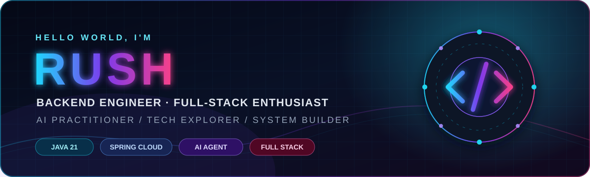

<div align="center">
  
</div>

<div align="center">
  
</div>

<div align="center">
  
  
  
  
</div>

<p align="center">
  <a href="#-关于我">关于我</a> ·
  <a href="#-技术能力雷达">技术能力</a> ·
  <a href="#-技术栈">技术栈</a> ·
  <a href="#-ai-工程实践">AI 实践</a> ·
  <a href="#-代表性项目">代表项目</a> ·
  <a href="#-技术信仰">技术信仰</a>
</p>

---

## 👨‍💻 关于我

> **你好，我是 Rush，一名以 Java 为核心武器的后端开发工程师，也是一名对全栈开发和 AI 技术保持长期热情的技术狂热者。**

我热衷于把复杂业务拆解成清晰、稳定、可扩展的系统，用工程化思维解决性能、并发、可靠性与可维护性问题。对我而言，技术不只是谋生工具，更是一种理解世界和创造产品的方式。从 JVM、微服务、分布式系统到 Vue、云原生，再到大模型、RAG、AI Agent 与智能编程，我始终站在技术演进的第一线——**不只关注新技术，更关注如何让它真正进入生产、创造价值。**

```java
/**
 * DeveloperProfile.java
 *
 * 关键词：后端深度、全栈视野、AI 落地、工程洁癖、持续进化
 */
public final class Rush implements BackendEngineer, FullStackBuilder, AIPractitioner {

    private final List<String> coreStrengths = List.of(
            "Java & JVM",
            "Spring Ecosystem",
            "Distributed Systems",
            "High-Concurrency Architecture",
            "Cloud Native",
            "Full-Stack Engineering",
            "LLM Application Development"
    );

    @Override
    public String mission() {
        return "Build elegant systems, solve hard problems, ship real value.";
    }

    @Override
    public boolean stopLearning() {
        return false;
    }
}
```

| `BACKEND` | `ARCHITECTURE` | `FULL STACK` | `AI NATIVE` |
| :---: | :---: | :---: | :---: |
| 深耕 Java 生态 | 追求系统级思考 | 保持产品全局视野 | 坚持 AI 工程化落地 |

## ⚡ 我的技术标签

- ☕ **Java 后端工程师**：熟悉现代 Java、JVM、并发编程、性能优化与 Spring 技术生态
- 🏗️ **系统架构实践者**：关注高并发、高可用、分布式一致性、领域建模和服务治理
- 🌐 **全栈爱好者**：能够从数据库、服务端、API 一直打通到 Web 前端和部署链路
- 🤖 **AI 技术从业者**：持续实践 LLM、RAG、Agent、MCP、模型路由和 AI Coding
- 🔥 **技术狂热者**：喜欢阅读源码、研究原理、挑战复杂问题，并把探索沉淀为工程能力
- 🧭 **长期主义者**：相信优秀的软件来自清晰设计、可靠验证和持续演进，而不是短期堆砌

## 🧠 技术能力雷达

| 领域 | 能力关键词 |
| --- | --- |
| **Java 核心** | Java 21、集合与泛型、反射、并发编程、虚拟线程、JVM、GC、性能诊断 |
| **后端框架** | Spring Boot、Spring MVC、Spring Security、Spring Cloud、MyBatis、JPA、Netty |
| **分布式系统** | 服务治理、限流熔断、分布式锁、分布式事务、幂等、最终一致性、任务调度 |
| **消息与缓存** | Redis、Caffeine、Kafka、RocketMQ、RabbitMQ、缓存一致性、消息可靠投递 |
| **数据工程** | MySQL、PostgreSQL、Elasticsearch、MongoDB、SQL 优化、索引设计、数据建模 |
| **云原生与运维** | Docker、Kubernetes、Nginx、Linux、CI/CD、Prometheus、Grafana、链路追踪 |
| **前端工程** | Vue 3、React、TypeScript、Vite、Pinia、组件化、前后端契约设计 |
| **AI 工程** | LangChain4j、RAG、AI Agent、MCP、Prompt Engineering、向量检索、模型评测 |

## 🧰 技术栈

### 后端与架构

<div align="center">
  
</div>

### 云原生与工程效率

<div align="center">
  
</div>

### 前端与产品实现

<div align="center">
  
</div>

### AI 与智能应用

<div align="center">
  
  <br /><br />
  
  
  
  
  
  
</div>

## 🏗️ 我擅长解决的问题

<table>
  <tr>
    <td width="33%" valign="top">
      <h3>⚙️ 复杂后端系统</h3>
      <p>把复杂业务拆解为边界清晰的模块，兼顾领域模型、接口契约、数据一致性、扩展能力与长期维护成本。</p>
    </td>
    <td width="33%" valign="top">
      <h3>🚄 高并发与高可用</h3>
      <p>围绕缓存、消息队列、限流、降级、异步化、线程模型和容量规划，构建可观测、可恢复的稳定系统。</p>
    </td>
    <td width="33%" valign="top">
      <h3>🧩 工程效率提升</h3>
      <p>通过自动化测试、CI/CD、脚手架、代码生成、质量门禁和 AI 工具链，让团队更快、更稳地交付价值。</p>
    </td>
  </tr>
  <tr>
    <td width="33%" valign="top">
      <h3>🔍 性能诊断与优化</h3>
      <p>从 JVM、SQL、缓存、网络、锁竞争到调用链进行系统化分析，用数据定位瓶颈，而不是凭感觉优化。</p>
    </td>
    <td width="33%" valign="top">
      <h3>🌐 全栈产品落地</h3>
      <p>打通需求、交互、前端、后端、数据库、部署与监控链路，让技术方案最终形成完整可用的产品。</p>
    </td>
    <td width="33%" valign="top">
      <h3>🤖 AI 能力工程化</h3>
      <p>把模型调用升级为稳定的 AI 应用系统，覆盖上下文管理、知识检索、工具调用、评测、成本与安全治理。</p>
    </td>
  </tr>
</table>

## 🤖 AI 工程实践

我相信，AI 不会简单地取代工程师，但会重新定义优秀工程师的生产方式。我的目标不是停留在“调用一次模型 API”，而是让 AI 真正成为软件系统中的生产力组件。

```text
用户需求
   │
   ▼
意图识别 ──► 模型路由 ──► 上下文工程 ──► Agent 编排
   │                              │
   │                              ├──► RAG / 向量检索
   │                              ├──► MCP / 工具调用
   │                              ├──► 代码执行与验证
   │                              └──► 记忆与状态管理
   ▼
安全护栏 ──► 质量评测 ──► 可观测性 ──► 生产交付
```

### 重点关注方向

- **AI Agent**：任务规划、工具选择、状态管理、失败恢复与多智能体协作
- **RAG**：文档解析、分块策略、混合检索、重排序、引用追踪与效果评测
- **MCP**：把数据库、文件系统、浏览器、代码仓库和内部服务连接给模型
- **AI Coding**：需求理解、代码生成、自动修改、测试验证、审查和交付闭环
- **模型工程**：模型路由、超时重试、降级策略、Token 成本、吞吐与可观测性
- **AI 安全**：提示词注入防护、权限边界、敏感数据治理与工具调用审计

## 🚀 代表性项目

> 以下项目用于展示我的技术方向与工程能力，名称及数据可根据实际经历替换。

### 🌌 Nebula AI Engineering Platform

**面向研发团队的企业级 AI 工程平台**

`Java 21` · `Spring Boot` · `LangChain4j` · `Redis` · `PostgreSQL` · `Vue 3` · `Docker`

- 支持多模型接入、动态路由、流式响应和统一模型治理
- 集成知识库 RAG、Agent 工具调用、会话记忆与安全护栏
- 构建从需求到代码生成、测试、预览和部署的自动化工作流
- 对模型耗时、Token、成本、成功率和工具调用进行全链路观测

### ⚡ Hyperion Distributed Service Platform

**面向高并发业务的微服务与中间件实践平台**

`Spring Cloud` · `Kafka` · `Redis` · `MySQL` · `Elasticsearch` · `Kubernetes`

- 设计高可用服务治理、分布式限流、缓存一致性与消息可靠性方案
- 建立统一网关、认证授权、审计日志和异常治理体系
- 通过压测、容量评估和故障演练持续提升系统稳定性
- 使用 Prometheus、Grafana 和链路追踪构建可观测性闭环

### 🛰️ Atlas Full-Stack Developer Console

**面向开发者的一站式项目管理与运维控制台**

`Spring Boot` · `Vue 3` · `TypeScript` · `Docker` · `Nginx` · `WebSocket`

- 覆盖项目管理、任务调度、实时日志、配置中心和部署流水线
- 使用前后端统一类型契约降低接口协作成本
- 支持实时状态推送、异常告警、权限控制和操作审计
- 将复杂基础设施能力包装成清晰、易用的产品体验

## 📚 当前持续探索

```yaml
currently_building:
  - Production-ready AI Agent architecture
  - RAG evaluation and knowledge engineering
  - Java virtual threads and high-throughput services
  - AI-powered software delivery workflow

currently_studying:
  - LLM inference and model routing
  - Distributed system reliability
  - Cloud-native observability
  - Human-AI collaborative programming

always_doing:
  - Reading source code
  - Refactoring for clarity
  - Automating repetitive work
  - Turning ideas into working software
```

## 💎 技术信仰

<div align="center">
  <h3><code>Keep it simple, but never simplistic.</code></h3>
  <h3><code>代码要能运行，系统要能演进，技术要能创造价值。</code></h3>
</div>

| 我相信 | 我拒绝 |
| :--- | :--- |
| 用清晰设计驾驭复杂度 | 为了快速交付制造长期技术债 |
| 用测试和数据证明可靠性 | 用“应该没问题”代替工程验证 |
| 深入原理，也重视业务价值 | 只追逐名词而不解决真实问题 |
| 让 AI 放大人的创造力 | 把 AI 当成无需治理的魔法黑盒 |

## 🤝 和我聊这些

<div align="center">

`Java`　`JVM`　`Spring`　`微服务`　`分布式系统`　`系统架构`

`Vue`　`全栈开发`　`云原生`　`DevOps`　`性能优化`　`开源技术`

`LLM`　`RAG`　`AI Agent`　`MCP`　`AI Coding`　`智能应用工程`

<br />

**如果你也热爱技术、喜欢创造、相信 AI 正在重塑软件工程——我们一定有很多可以交流。**

</div>

---

<div align="center">
  <strong>Stay hungry for knowledge. Stay fearless in creation.</strong>
  <br /><br />
  <em>以代码构建系统，以技术拓展边界，以 AI 创造未来。</em>
</div>


